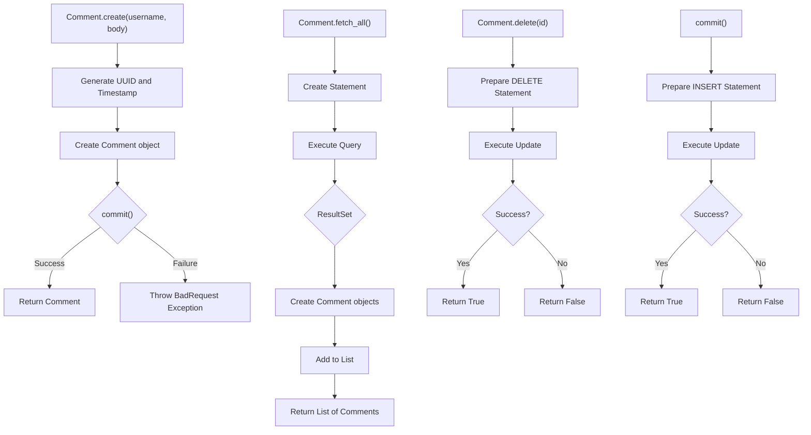
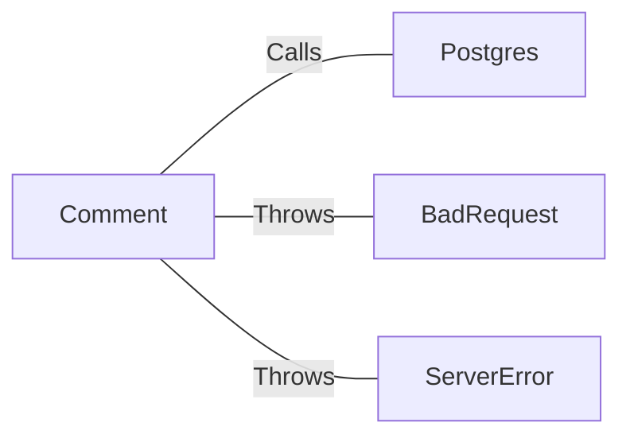

# Comment.java: Comment Management

## Overview
This class is responsible for managing comments, including creating, fetching, and deleting comments from a PostgreSQL database. It handles the interaction with the database and ensures that comments are properly stored and retrieved.

## Process Flow

## Insights
- The `Comment` class interacts with a PostgreSQL database to manage comments.
- The `create` method generates a new comment with a unique ID and timestamp, then attempts to save it to the database.
- The `fetch_all` method retrieves all comments from the database.
- The `delete` method removes a comment from the database based on its ID.
- The `commit` method is used internally to save a new comment to the database.

## Dependencies

- `Postgres`: Provides the database connection for executing SQL queries.
- `BadRequest`: Exception thrown when a comment cannot be saved.
- `ServerError`: Exception thrown when there is a server error.

## Data Manipulation (SQL)
### Table: comments
| Attribute   | Type      | Description                        |
|-------------|-----------|------------------------------------|
| id          | String    | Unique identifier for the comment  |
| username    | String    | Username of the commenter          |
| body        | String    | Content of the comment             |
| created_on  | Timestamp | Timestamp when the comment was created |

### SQL Operations
- `INSERT INTO comments (id, username, body, created_on)`: Inserts a new comment into the database.
- `SELECT * FROM comments`: Retrieves all comments from the database.
- `DELETE FROM comments WHERE id = ?`: Deletes a comment from the database based on its ID.

## Vulnerabilities
- **SQL Injection**: The `fetch_all` method uses a raw SQL query, which is vulnerable to SQL injection. Prepared statements should be used to mitigate this risk.
- **Resource Management**: The `fetch_all` and `delete` methods do not properly close database resources (e.g., `Statement`, `ResultSet`, `Connection`), which can lead to resource leaks.
- **Error Handling**: The `delete` method always returns `false` due to the `finally` block, even if the deletion is successful. This should be corrected to return the actual result of the deletion operation.
