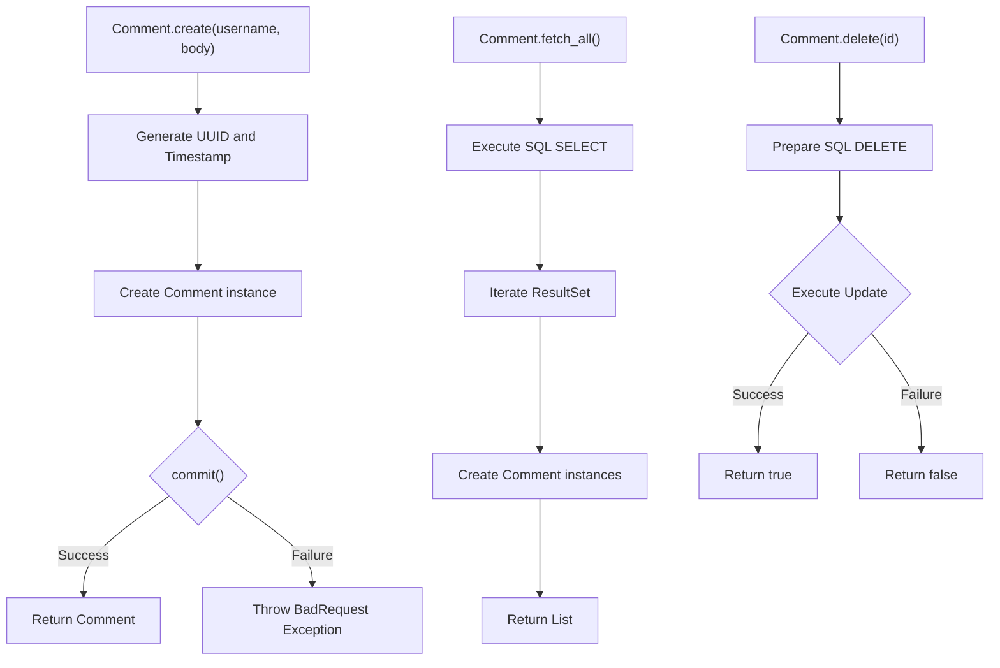
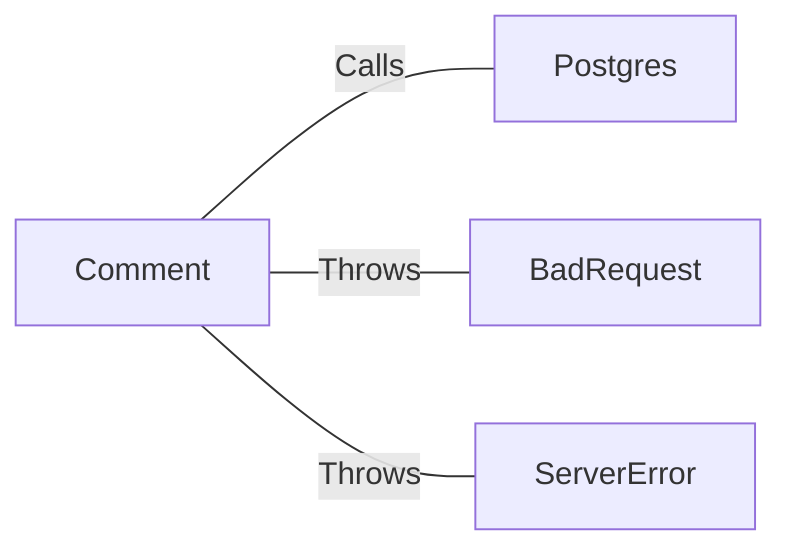

# Comment.java: Comment Management

## Overview
The `Comment` class is responsible for managing comments, including creating, fetching, and deleting comments from a PostgreSQL database. It provides methods to create a new comment, fetch all comments, and delete a comment by its ID.

## Process Flow

## Insights
- The `Comment` class interacts with a PostgreSQL database to perform CRUD operations on comments.
- The `create` method generates a unique ID and timestamp for each new comment.
- The `fetch_all` method retrieves all comments from the database.
- The `delete` method removes a comment from the database based on its ID.
- The `commit` method inserts a new comment into the database.

## Dependencies

- `Postgres`: Provides the database connection for executing SQL queries.
- `BadRequest`: Exception thrown when a comment cannot be saved.
- `ServerError`: Exception thrown when there is a server error.

## Data Manipulation (SQL)
### Table: comments
| Attribute   | Type      | Description                        |
|-------------|-----------|------------------------------------|
| id          | String    | Unique identifier for the comment  |
| username    | String    | Username of the commenter          |
| body        | String    | Content of the comment             |
| created_on  | Timestamp | Timestamp when the comment was created |

### SQL Operations
- `INSERT INTO comments (id, username, body, created_on) VALUES (?,?,?,?)`: Inserts a new comment into the `comments` table.
- `SELECT * FROM comments`: Retrieves all comments from the `comments` table.
- `DELETE FROM comments WHERE id = ?`: Deletes a comment from the `comments` table based on its ID.

## Vulnerabilities
- **SQL Injection**: The `fetch_all` method uses a raw SQL query which is vulnerable to SQL injection. It is recommended to use prepared statements to mitigate this risk.
- **Exception Handling**: The `delete` method always returns `false` due to the `finally` block. This should be corrected to return the actual result of the delete operation.
- **Resource Management**: The `fetch_all` method does not properly close the `Statement` and `ResultSet` objects, which can lead to resource leaks.
