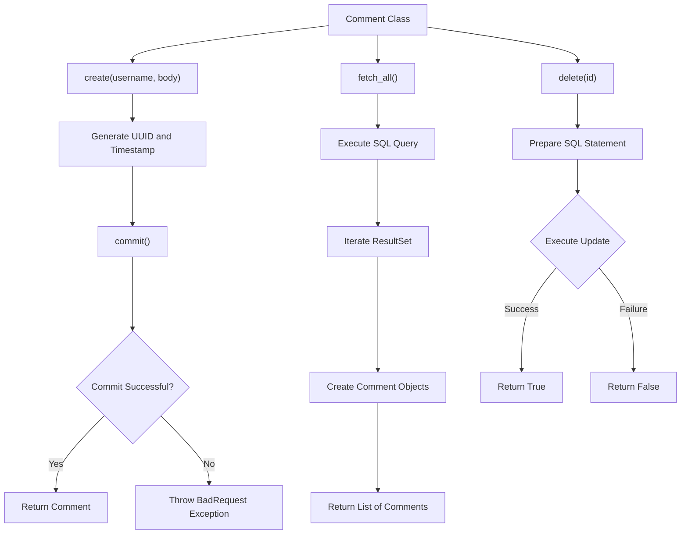
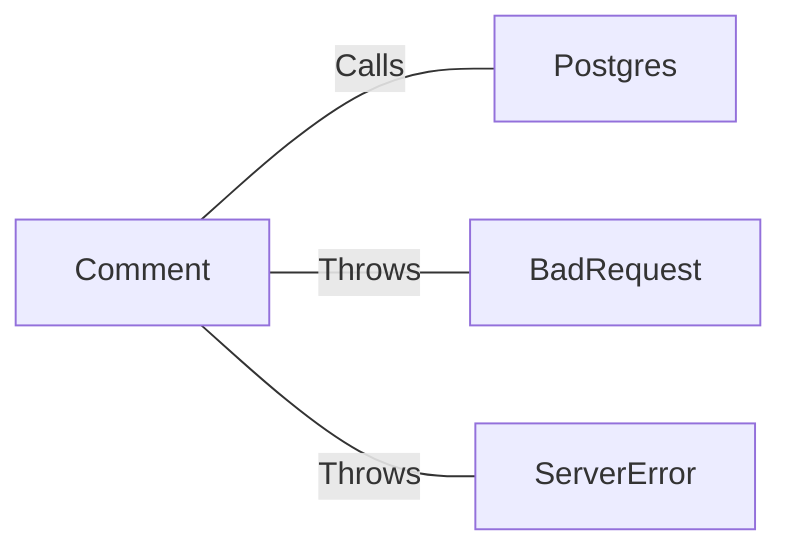

# Comment.java: Comment Management

## Overview
The `Comment` class is responsible for managing comments in the application. It provides functionalities to create, fetch, and delete comments from a PostgreSQL database.

## Process Flow

```mermaid
flowchart TD
    A["Comment Class"] --> B["create(username, body)"]
    B --> C["Generate UUID and Timestamp"]
    C --> D["commit()"]
    D --> E{"Commit Successful?"}
    E --> |"Yes"| F["Return Comment"]
    E --> |"No"| G["Throw BadRequest Exception"]
    A --> H["fetch_all()"]
    H --> I["Execute SQL Query"]
    I --> J["Iterate ResultSet"]
    J --> K["Create Comment Objects"]
    K --> L["Return List of Comments"]
    A --> M["delete(id)"]
    M --> N["Prepare SQL Statement"]
    N --> O{"Execute Update"}
    O --> |"Success"| P["Return True"]
    O --> |"Failure"| Q["Return False"]
```

## Insights
- The `Comment` class interacts with a PostgreSQL database to perform CRUD operations on comments.
- The `create` method generates a unique ID and timestamp for each comment and attempts to save it to the database.
- The `fetch_all` method retrieves all comments from the database and returns them as a list.
- The `delete` method removes a comment from the database based on its ID.
- The `commit` method is a private method used to insert a new comment into the database.

## Dependencies

```mermaid
flowchart LR
    Comment --- |"Calls"| Postgres
    Comment --- |"Throws"| BadRequest
    Comment --- |"Throws"| ServerError
```

- `Postgres`: Used to establish a connection to the PostgreSQL database.
- `BadRequest`: Exception thrown when a comment cannot be saved.
- `ServerError`: Exception thrown when there is a server error.

## Data Manipulation (SQL)
### Table: comments
| Attribute   | Type      | Description                        |
|-------------|-----------|------------------------------------|
| id          | String    | Unique identifier for the comment  |
| username    | String    | Username of the commenter          |
| body        | String    | Content of the comment             |
| created_on  | Timestamp | Timestamp when the comment was created |

### SQL Operations
- `INSERT INTO comments (id, username, body, created_on) VALUES (?,?,?,?)`: Inserts a new comment into the `comments` table.
- `SELECT * FROM comments`: Retrieves all comments from the `comments` table.
- `DELETE FROM comments WHERE id = ?`: Deletes a comment from the `comments` table based on its ID.

## Vulnerabilities
- **SQL Injection**: The `fetch_all` method uses raw SQL queries which can be vulnerable to SQL injection attacks. It is recommended to use prepared statements to mitigate this risk.
- **Error Handling**: The `delete` method always returns `false` due to the `finally` block. Proper error handling should be implemented to return the correct status.
- **Resource Management**: The `fetch_all` method does not properly close the `Statement` and `ResultSet` objects, which can lead to resource leaks.
