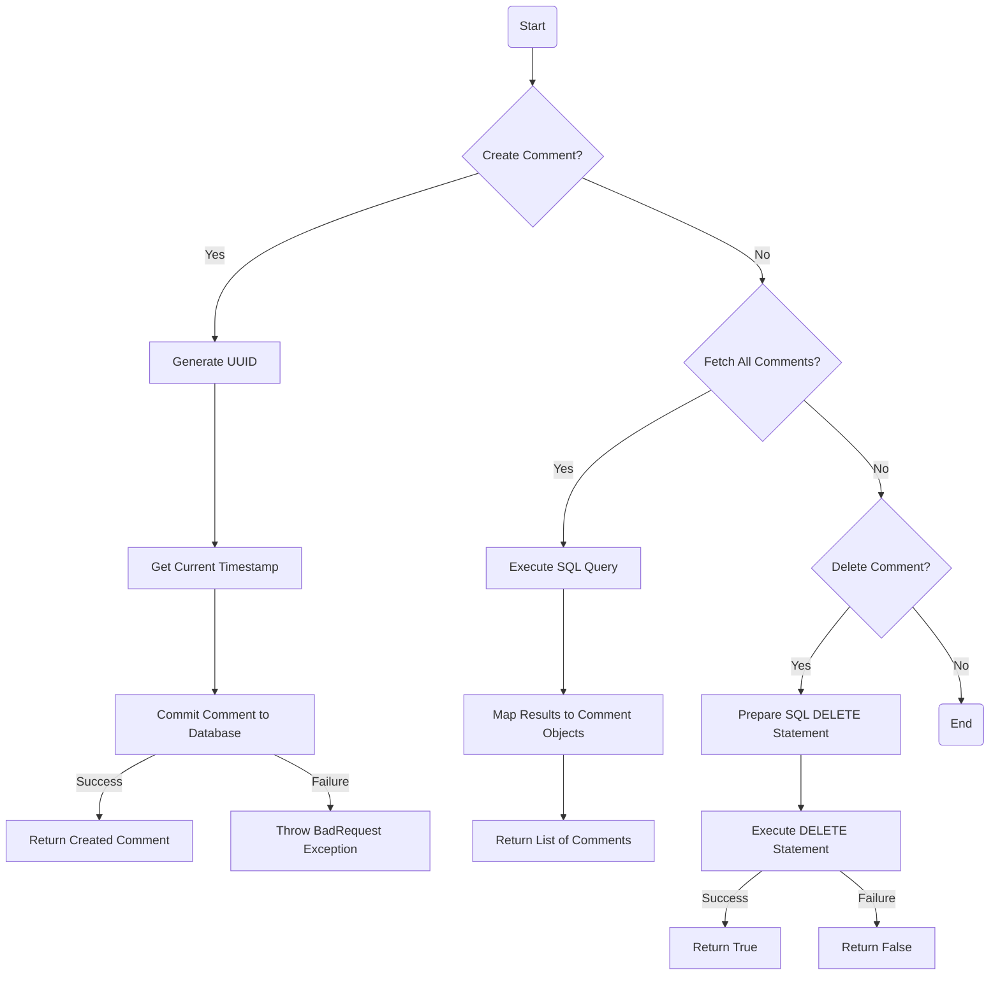
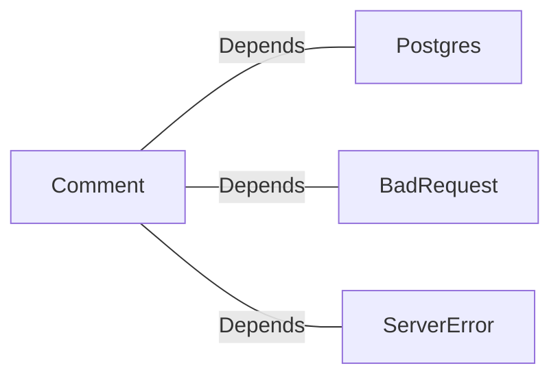

# Comment.java: Comment Management Class

## Overview

This class provides functionality for managing comments in a database. It includes methods for creating, fetching, and deleting comments, as well as persisting them to a PostgreSQL database. The `Comment` class encapsulates the attributes of a comment and provides static methods for interacting with the database.

## Process Flow

```mermaid
flowchart TD
    Start("Start") --> CreateComment{"Create Comment?"}
    CreateComment --> |"Yes"| GenerateUUID["Generate UUID"]
    GenerateUUID --> GetTimestamp["Get Current Timestamp"]
    GetTimestamp --> CommitComment["Commit Comment to Database"]
    CommitComment --> |"Success"| ReturnComment["Return Created Comment"]
    CommitComment --> |"Failure"| ThrowBadRequest["Throw BadRequest Exception"]
    CreateComment --> |"No"| FetchAll{"Fetch All Comments?"}
    FetchAll --> |"Yes"| ExecuteQuery["Execute SQL Query"]
    ExecuteQuery --> MapResults["Map Results to Comment Objects"]
    MapResults --> ReturnComments["Return List of Comments"]
    FetchAll --> |"No"| DeleteComment{"Delete Comment?"}
    DeleteComment --> |"Yes"| PrepareDeleteStatement["Prepare SQL DELETE Statement"]
    PrepareDeleteStatement --> ExecuteDelete["Execute DELETE Statement"]
    ExecuteDelete --> |"Success"| ReturnTrue["Return True"]
    ExecuteDelete --> |"Failure"| ReturnFalse["Return False"]
    DeleteComment --> |"No"| End("End")
```

## Insights

- The `Comment` class encapsulates the attributes of a comment (`id`, `username`, `body`, `created_on`) and provides methods for database operations.
- The `create` method generates a new comment with a unique ID and timestamp, then persists it to the database.
- The `fetch_all` method retrieves all comments from the database and maps them to `Comment` objects.
- The `delete` method removes a comment from the database based on its ID.
- The `commit` method is a private helper used to insert a comment into the database.
- The class uses `Postgres.connection()` to establish database connections, which is assumed to be defined elsewhere.

## Vulnerabilities

1. **SQL Injection Risk in `fetch_all` Method**:
   - The `fetch_all` method uses a raw SQL query (`select * from comments;`) without parameterized queries, which could be exploited if the query is dynamically constructed in the future.

2. **Improper Exception Handling in `delete` Method**:
   - The `delete` method always returns `false` in the `finally` block, even if the operation succeeds. This can lead to incorrect behavior.

3. **Potential Resource Leaks**:
   - Database connections (`Connection`, `Statement`, `PreparedStatement`) are not properly closed in `fetch_all`, `delete`, and `commit` methods, which can lead to resource leaks.

4. **Lack of Input Validation**:
   - The `create` and `delete` methods do not validate input parameters (`username`, `body`, `id`), which could lead to invalid or malicious data being processed.

5. **Error Disclosure**:
   - Exceptions are printed to the console (`e.printStackTrace()`), which could expose sensitive information in a production environment.

## Dependencies

```mermaid
flowchart LR
    Comment --- |"Depends"| Postgres
    Comment --- |"Depends"| BadRequest
    Comment --- |"Depends"| ServerError
```

- `Postgres`: Provides the `connection()` method for establishing database connections.
- `BadRequest`: Custom exception thrown when a comment cannot be saved.
- `ServerError`: Custom exception thrown for server-side errors.

## Data Manipulation (SQL)

### Table: `comments`

| Attribute   | Data Type   | Description                          |
|-------------|-------------|--------------------------------------|
| `id`        | `VARCHAR`   | Unique identifier for the comment.  |
| `username`  | `VARCHAR`   | Username of the comment author.     |
| `body`      | `TEXT`      | Content of the comment.             |
| `created_on`| `TIMESTAMP` | Timestamp when the comment was created. |

### SQL Operations

1. **INSERT**:
   - Inserts a new comment into the `comments` table.
   - SQL: `INSERT INTO comments (id, username, body, created_on) VALUES (?,?,?,?)`

2. **SELECT**:
   - Retrieves all comments from the `comments` table.
   - SQL: `SELECT * FROM comments;`

3. **DELETE**:
   - Deletes a comment from the `comments` table based on its ID.
   - SQL: `DELETE FROM comments WHERE id = ?`
