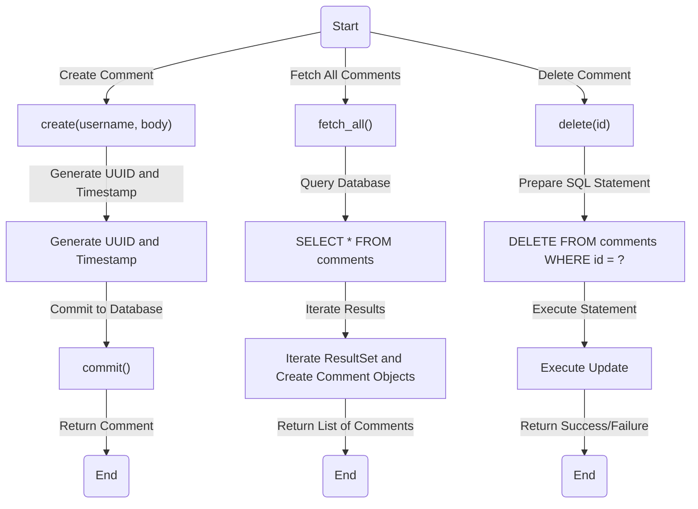
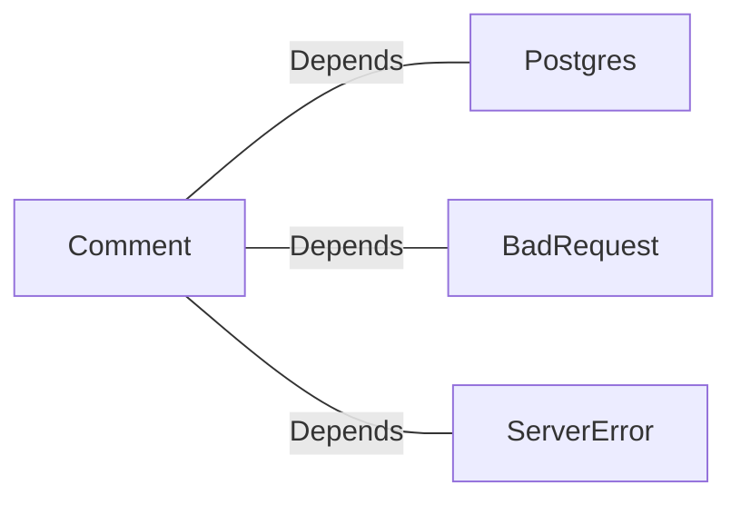

# Comment.java: Comment Management Class

## Overview

The `Comment` class is responsible for managing comments in an application. It provides functionality to create, fetch, and delete comments, as well as persist them to a database. The class interacts with a PostgreSQL database to store and retrieve comment data.

## Process Flow

```mermaid
flowchart TD
    Start("Start") --> |"Create Comment"| CreateComment["create(username, body)"]
    CreateComment --> |"Generate UUID and Timestamp"| GenerateUUIDTimestamp["Generate UUID and Timestamp"]
    GenerateUUIDTimestamp --> |"Commit to Database"| CommitToDB["commit()"]
    CommitToDB --> |"Return Comment"| EndCreate("End")

    Start --> |"Fetch All Comments"| FetchAllComments["fetch_all()"]
    FetchAllComments --> |"Query Database"| QueryDB["SELECT * FROM comments"]
    QueryDB --> |"Iterate Results"| IterateResults["Iterate ResultSet and Create Comment Objects"]
    IterateResults --> |"Return List of Comments"| EndFetch("End")

    Start --> |"Delete Comment"| DeleteComment["delete(id)"]
    DeleteComment --> |"Prepare SQL Statement"| PrepareSQL["DELETE FROM comments WHERE id = ?"]
    PrepareSQL --> |"Execute Statement"| ExecuteDelete["Execute Update"]
    ExecuteDelete --> |"Return Success/Failure"| EndDelete("End")
```

## Insights

- The `Comment` class encapsulates the logic for creating, fetching, and deleting comments.
- The `create` method generates a unique ID and timestamp for each comment and persists it to the database.
- The `fetch_all` method retrieves all comments from the database and maps them to `Comment` objects.
- The `delete` method removes a comment from the database based on its ID.
- The `commit` method is a private helper used to insert a comment into the database.
- The class uses `Postgres.connection()` to establish a database connection, which is assumed to be defined elsewhere.

## Vulnerabilities

1. **SQL Injection Risk in `fetch_all` Method**:
   - The `fetch_all` method uses a raw SQL query (`select * from comments;`) without parameterized queries, which could be exploited if the query is dynamically constructed in the future.

2. **Improper Exception Handling in `delete` Method**:
   - The `delete` method always returns `false` in the `finally` block, even if the operation succeeds. This can lead to incorrect behavior.

3. **Resource Management**:
   - Database connections and statements are not properly closed in `fetch_all`, `delete`, and `commit` methods, which can lead to resource leaks.

4. **Error Handling in `create` Method**:
   - The `create` method wraps exceptions in a custom `ServerError` but does not log or provide detailed information about the error, which can hinder debugging.

5. **Potential NullPointerException**:
   - If `Postgres.connection()` returns `null`, methods like `fetch_all`, `delete`, and `commit` will throw a `NullPointerException`.

## Dependencies

```mermaid
flowchart LR
    Comment --- |"Depends"| Postgres
    Comment --- |"Depends"| BadRequest
    Comment --- |"Depends"| ServerError
```

- `Postgres`: Provides the `connection()` method to establish a database connection.
- `BadRequest`: Custom exception thrown when a comment cannot be saved.
- `ServerError`: Custom exception thrown for server-side errors.

## Data Manipulation (SQL)

### Table: `comments`

| Attribute   | Data Type   | Description                          |
|-------------|-------------|--------------------------------------|
| `id`        | `VARCHAR`   | Unique identifier for the comment.  |
| `username`  | `VARCHAR`   | Username of the comment author.     |
| `body`      | `TEXT`      | Content of the comment.             |
| `created_on`| `TIMESTAMP` | Timestamp when the comment was created. |

### SQL Operations

1. **INSERT**:
   - Inserts a new comment into the `comments` table.
   - SQL: `INSERT INTO comments (id, username, body, created_on) VALUES (?,?,?,?)`

2. **SELECT**:
   - Fetches all comments from the `comments` table.
   - SQL: `SELECT * FROM comments`

3. **DELETE**:
   - Deletes a comment from the `comments` table based on its ID.
   - SQL: `DELETE FROM comments WHERE id = ?`
