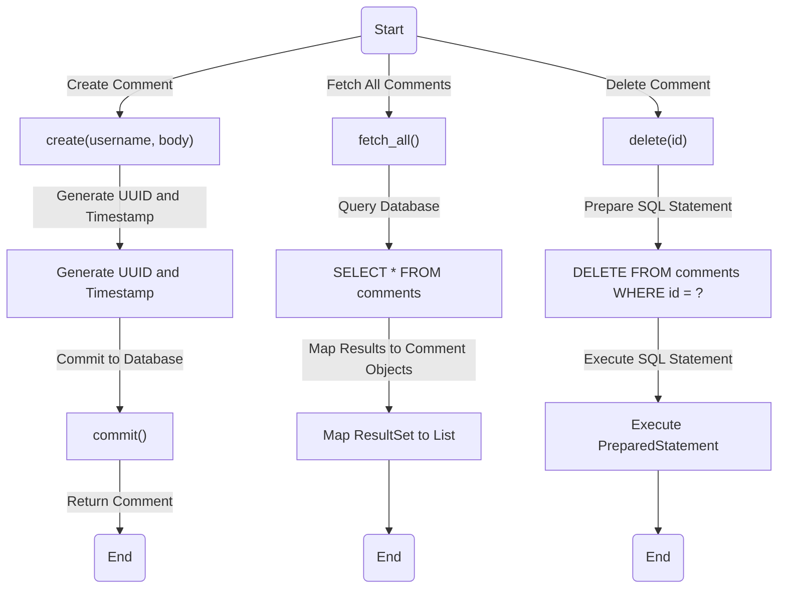
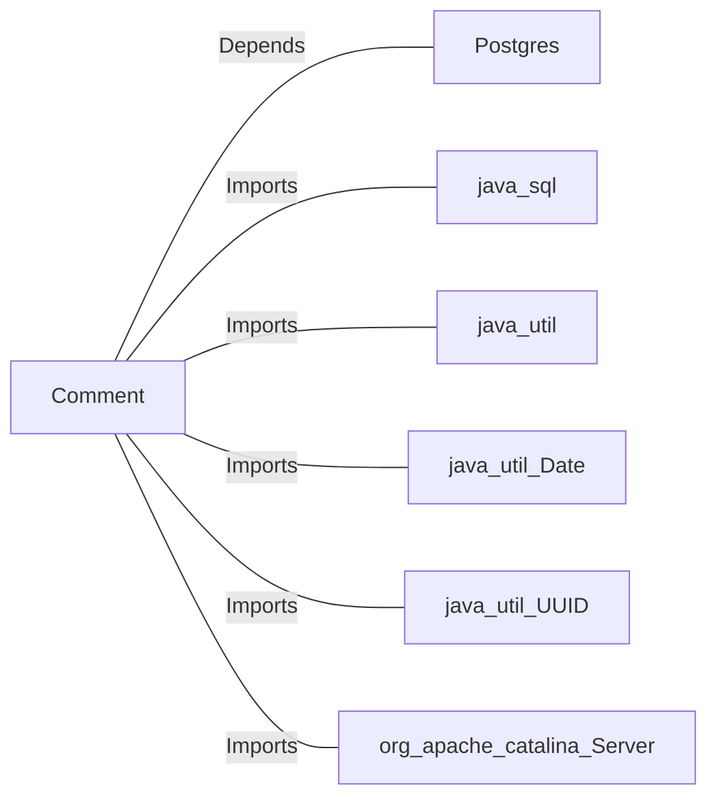

# Comment.java: Comment Management Class

## Overview

The `Comment` class is responsible for managing comments in a system. It provides functionality to create, fetch, and delete comments, as well as to persist them in a database. The class interacts with a PostgreSQL database to perform these operations.

## Process Flow

```mermaid
flowchart TD
    Start("Start") --> |"Create Comment"| CreateComment["create(username, body)"]
    CreateComment --> |"Generate UUID and Timestamp"| GenerateUUIDTimestamp["Generate UUID and Timestamp"]
    GenerateUUIDTimestamp --> |"Commit to Database"| CommitToDatabase["commit()"]
    CommitToDatabase --> |"Return Comment"| EndCreate("End")

    Start --> |"Fetch All Comments"| FetchAllComments["fetch_all()"]
    FetchAllComments --> |"Query Database"| QueryDatabase["SELECT * FROM comments"]
    QueryDatabase --> |"Map Results to Comment Objects"| MapResults["Map ResultSet to List<Comment>"]
    MapResults --> EndFetch("End")

    Start --> |"Delete Comment"| DeleteComment["delete(id)"]
    DeleteComment --> |"Prepare SQL Statement"| PrepareDeleteSQL["DELETE FROM comments WHERE id = ?"]
    PrepareDeleteSQL --> |"Execute SQL Statement"| ExecuteDeleteSQL["Execute PreparedStatement"]
    ExecuteDeleteSQL --> EndDelete("End")
```

## Insights

- The `Comment` class encapsulates the logic for managing comments, including creating, fetching, and deleting them.
- The `create` method generates a unique identifier (UUID) and a timestamp for each comment before persisting it in the database.
- The `fetch_all` method retrieves all comments from the database and maps them to `Comment` objects.
- The `delete` method removes a comment from the database based on its unique identifier.
- The `commit` method is a private helper function used to insert a comment into the database.
- The class uses `Postgres.connection()` to establish a connection to the database, which is assumed to be defined elsewhere.

## Vulnerabilities

1. **SQL Injection Risk in `fetch_all` Method**:
   - The `fetch_all` method uses a raw SQL query (`"select * from comments;"`) without parameterized queries, which could expose the system to SQL injection if the query were dynamically constructed.

2. **Improper Exception Handling in `delete` Method**:
   - The `delete` method always returns `false` in the `finally` block, even if the deletion was successful. This can lead to incorrect behavior or confusion for the caller.

3. **Resource Management**:
   - Database connections and statements are not properly closed in `fetch_all`, `delete`, and `commit` methods, which can lead to resource leaks.

4. **Error Handling in `create` Method**:
   - The `create` method wraps exceptions in a `ServerError`, but it does not log the original exception, which could make debugging difficult.

5. **Potential Null Pointer Exception**:
   - The `Postgres.connection()` method is assumed to always return a valid connection. If it returns `null`, the code will throw a `NullPointerException`.

## Dependencies

```mermaid
flowchart LR
    Comment --- |"Depends"| Postgres
    Comment --- |"Imports"| java_sql
    Comment --- |"Imports"| java_util
    Comment --- |"Imports"| java_util_Date
    Comment --- |"Imports"| java_util_UUID
    Comment --- |"Imports"| org_apache_catalina_Server
```

- `Postgres`: Provides the `connection()` method to establish a database connection.
- `java.sql`: Used for database operations such as `Connection`, `Statement`, `PreparedStatement`, and `ResultSet`.
- `java.util`: Used for `List` and `ArrayList`.
- `java.util.Date`: Used to generate timestamps.
- `java.util.UUID`: Used to generate unique identifiers for comments.
- `org.apache.catalina.Server`: Imported but not used in the code.

## Data Manipulation (SQL)

### Table: `comments`

| Column Name | Data Type   | Description                          |
|-------------|-------------|--------------------------------------|
| `id`        | `VARCHAR`   | Unique identifier for the comment.  |
| `username`  | `VARCHAR`   | Username of the comment author.     |
| `body`      | `TEXT`      | Content of the comment.             |
| `created_on`| `TIMESTAMP` | Timestamp when the comment was created. |

### SQL Operations

1. **INSERT**:
   - Inserts a new comment into the `comments` table.
   - SQL: `INSERT INTO comments (id, username, body, created_on) VALUES (?,?,?,?)`

2. **SELECT**:
   - Fetches all comments from the `comments` table.
   - SQL: `SELECT * FROM comments;`

3. **DELETE**:
   - Deletes a comment from the `comments` table based on its `id`.
   - SQL: `DELETE FROM comments WHERE id = ?`
