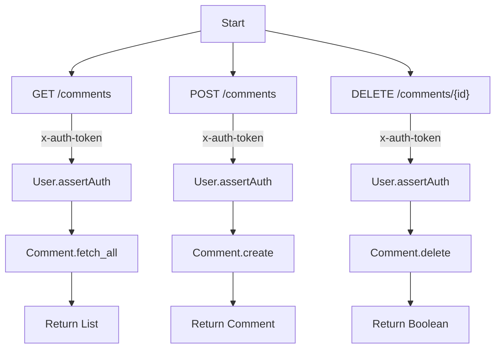
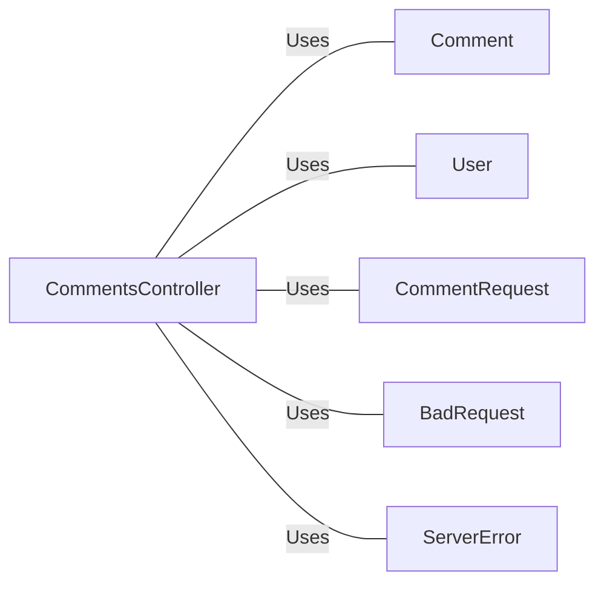

# CommentsController.java: Comments Management Controller

## Overview
The `CommentsController` class is a Spring Boot REST controller that manages comments. It provides endpoints to fetch all comments, create a new comment, and delete an existing comment. The controller uses token-based authentication to secure the endpoints.

## Process Flow

## Insights
- The controller uses `@CrossOrigin` to allow cross-origin requests from any origin.
- The `@Value` annotation is used to inject the application secret from the configuration.
- The `User.assertAuth` method is used to authenticate requests using a token.
- The `Comment` class is responsible for fetching, creating, and deleting comments.
- Custom exceptions `BadRequest` and `ServerError` are defined to handle specific HTTP status codes.

## Dependencies

- `Comment`: Handles fetching, creating, and deleting comments.
- `User`: Provides authentication functionality.
- `CommentRequest`: Data structure for creating a new comment.
- `BadRequest`: Custom exception for handling bad requests.
- `ServerError`: Custom exception for handling server errors.

## Data Manipulation (SQL)
- `Comment`: The class likely interacts with a database to perform CRUD operations on comments. The specific SQL operations are not detailed in the provided code.

## Vulnerabilities
- **Cross-Site Request Forgery (CSRF)**: The use of `@CrossOrigin(origins = "*")` without proper CSRF protection can expose the application to CSRF attacks.
- **Authentication Bypass**: The `User.assertAuth` method is used for authentication, but its implementation is not provided. If not implemented securely, it could lead to authentication bypass.
- **Injection Attacks**: If the `Comment.create` and `Comment.delete` methods do not properly sanitize inputs, the application could be vulnerable to SQL injection or other injection attacks.
