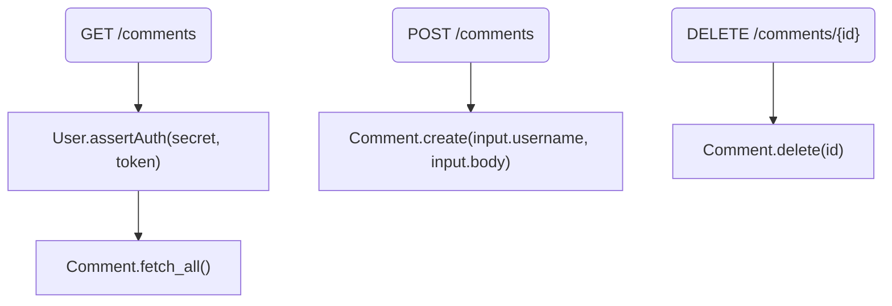
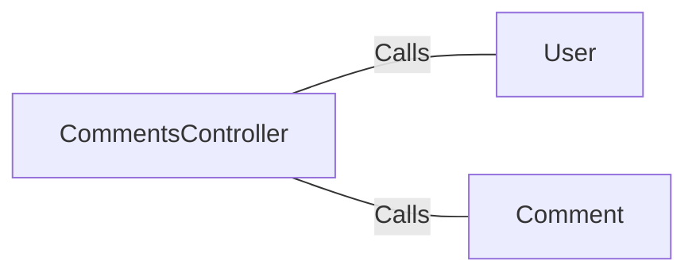

# CommentsController.java: Comments Management API

## Overview
The `CommentsController` class provides a RESTful API for managing comments. It includes endpoints for fetching, creating, and deleting comments. The class also handles authentication using a token and manages cross-origin requests.

## Process Flow

## Insights
- The class uses Spring Boot annotations to define a REST controller and enable auto-configuration.
- Authentication is handled by the `User.assertAuth` method, which uses a secret value from the application properties.
- Cross-origin requests are allowed from any origin.
- The class defines three main endpoints:
  - `GET /comments`: Fetches all comments.
  - `POST /comments`: Creates a new comment.
  - `DELETE /comments/{id}`: Deletes a comment by its ID.
- The `CommentRequest` class is a simple data structure for handling comment creation requests.
- Custom exceptions `BadRequest` and `ServerError` are defined to handle specific HTTP error responses.

## Dependencies

- `User`: Used for authentication with the method `assertAuth(secret, token)`.
- `Comment`: Used for fetching, creating, and deleting comments with methods `fetch_all()`, `create(username, body)`, and `delete(id)`.

## Vulnerabilities
- **Hardcoded Secret**: The secret value used for authentication is fetched from application properties, which might be hardcoded and not securely managed.
- **No Authentication Check for Comment Creation and Deletion**: The `createComment` and `deleteComment` methods do not perform authentication checks, potentially allowing unauthorized access.
- **Cross-Origin Resource Sharing (CORS)**: Allowing all origins (`*`) for CORS can expose the API to security risks, such as Cross-Site Request Forgery (CSRF) attacks.
- **Exception Handling**: The custom exceptions `BadRequest` and `ServerError` do not provide detailed error handling, which might lead to insufficient information for debugging and security analysis.
