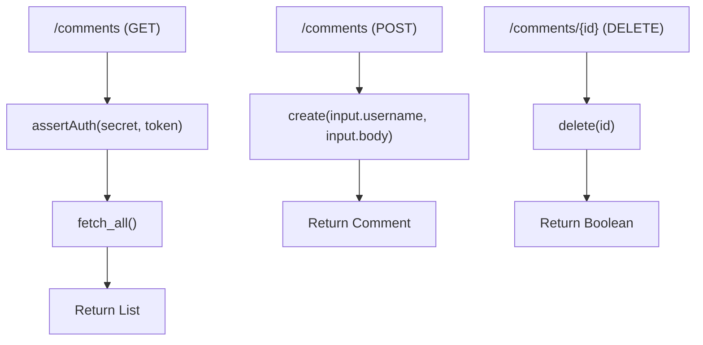
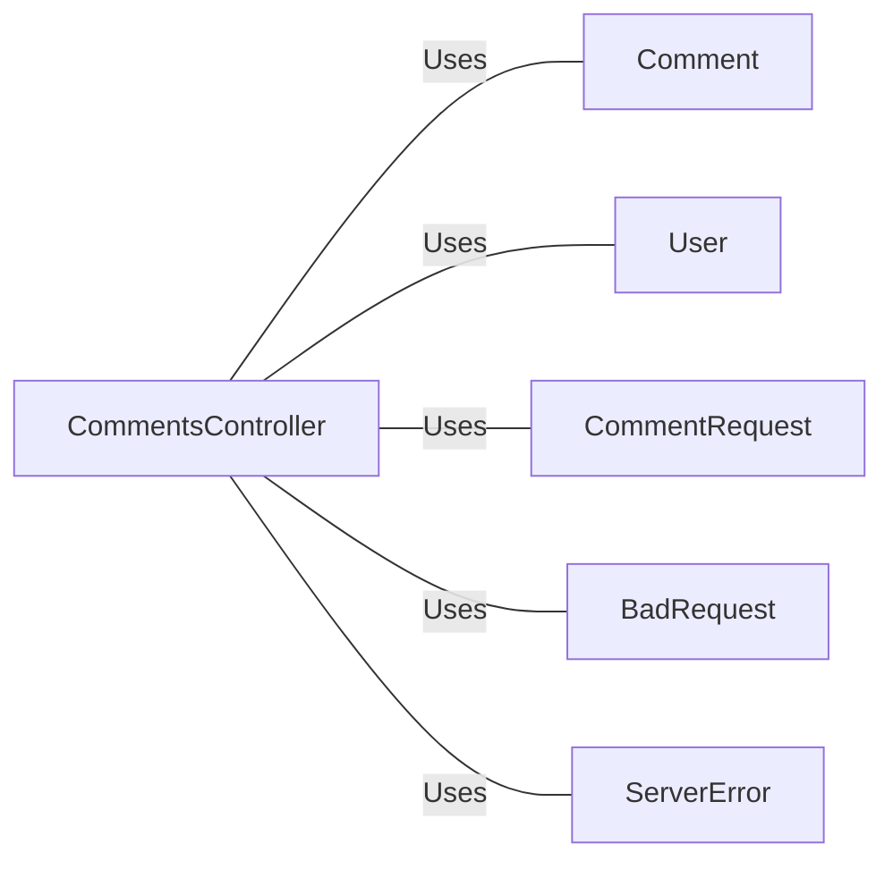

# CommentsController.java: Comments Management Controller

## Overview
The `CommentsController` class is a Spring Boot REST controller that handles HTTP requests related to comments. It provides endpoints to fetch all comments, create a new comment, and delete an existing comment. The controller also includes basic authentication using a token.

## Process Flow

## Insights
- The controller uses Spring Boot annotations to define REST endpoints.
- Basic token-based authentication is implemented using the `assertAuth` method.
- The `CommentRequest` class is a data structure used to encapsulate the request body for creating a comment.
- Custom exceptions `BadRequest` and `ServerError` are defined to handle specific HTTP status codes.

## Dependencies

- `Comment`: Used for fetching, creating, and deleting comments.
- `User`: Used for asserting authentication.
- `CommentRequest`: Data structure for the request body when creating a comment.
- `BadRequest`: Custom exception for handling bad requests.
- `ServerError`: Custom exception for handling server errors.

## Vulnerabilities
- **Hardcoded Secret**: The secret key is injected from the application properties, which can be a security risk if not properly managed.
- **Cross-Origin Resource Sharing (CORS)**: The `@CrossOrigin` annotation allows requests from any origin, which can be a security risk if not properly configured.
- **Authentication**: The `assertAuth` method is used for token-based authentication, but the implementation details are not provided, which may lead to potential security vulnerabilities if not properly implemented.
- **Error Handling**: Custom exceptions are defined, but there is no centralized error handling mechanism, which may lead to inconsistent error responses.
