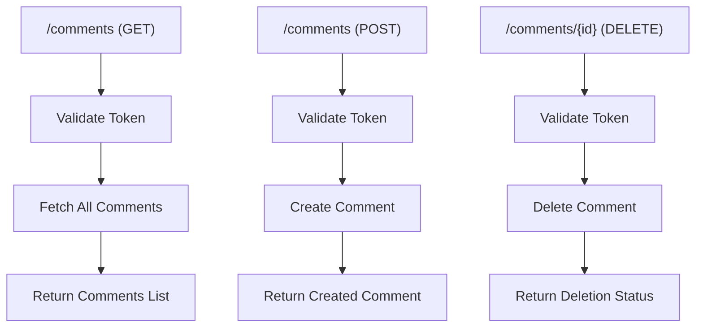
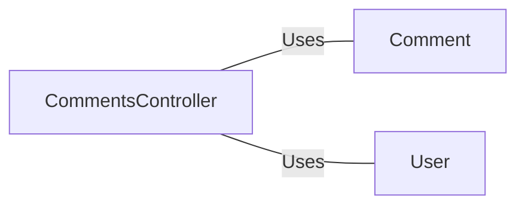

# CommentsController.java: Comments Management Controller

## Overview
The `CommentsController` class is a Spring Boot REST controller that manages comments. It provides endpoints to fetch all comments, create a new comment, and delete an existing comment. The controller also handles cross-origin requests and includes basic authentication using a token.

## Process Flow

## Insights
- The controller uses Spring Boot annotations to define REST endpoints and handle HTTP requests.
- Cross-origin requests are allowed from any origin.
- The `comments` method fetches all comments after validating the provided token.
- The `createComment` method creates a new comment without validating the token.
- The `deleteComment` method deletes a comment by its ID after validating the provided token.
- The `CommentRequest` class is a simple data structure used to encapsulate the request body for creating a comment.
- Custom exceptions `BadRequest` and `ServerError` are defined to handle specific HTTP status codes.

## Dependencies

- `Comment`: Used to fetch, create, and delete comments.
- `User`: Used to assert authentication based on the provided token.

## Vulnerabilities
- **Lack of Authentication in `createComment` Method**: The `createComment` method does not validate the provided token, which could allow unauthorized users to create comments.
- **Hardcoded Secret**: The secret used for authentication is injected from the application properties, which could be a security risk if not properly managed.
- **Cross-Origin Resource Sharing (CORS)**: Allowing all origins (`*`) for CORS can expose the application to security risks, such as Cross-Site Request Forgery (CSRF) attacks. It is recommended to restrict the origins to trusted domains.
