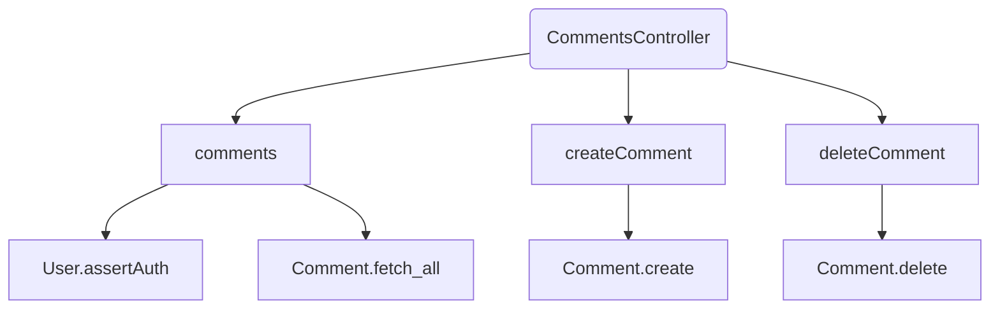
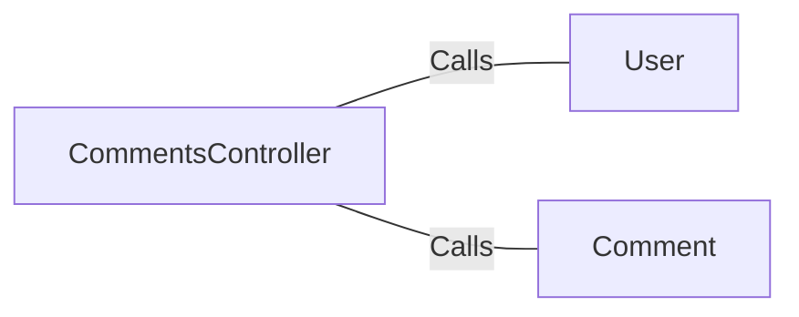

# CommentsController.java: Comments Management Controller

## Overview
The `CommentsController` class is a Spring Boot REST controller responsible for managing comments. It provides endpoints to fetch, create, and delete comments. The controller also handles authentication using a token and includes error handling for bad requests and server errors.

## Process Flow

```mermaid
flowchart TD
    A("CommentsController") --> B["comments"]
    A --> C["createComment"]
    A --> D["deleteComment"]
    B --> E["User.assertAuth"]
    B --> F["Comment.fetch_all"]
    C --> G["Comment.create"]
    D --> H["Comment.delete"]
```

## Insights
- The controller uses Spring Boot annotations to define REST endpoints.
- Authentication is handled using a token passed in the request header.
- The `comments` method fetches all comments after validating the token.
- The `createComment` method creates a new comment without validating the token.
- The `deleteComment` method deletes a comment by its ID without validating the token.
- The `CommentRequest` class is a simple data structure for comment creation requests.
- Custom exceptions `BadRequest` and `ServerError` are defined for error handling.

## Dependencies

```mermaid
flowchart LR
    CommentsController --- |"Calls"| User
    CommentsController --- |"Calls"| Comment
```

- `User`: Used for authentication by calling `assertAuth` method.
- `Comment`: Used for fetching, creating, and deleting comments.

## Data Manipulation (SQL)
- `Comment`: The class likely interacts with a database to perform CRUD operations on comments. The specific SQL operations are not detailed in the code.
