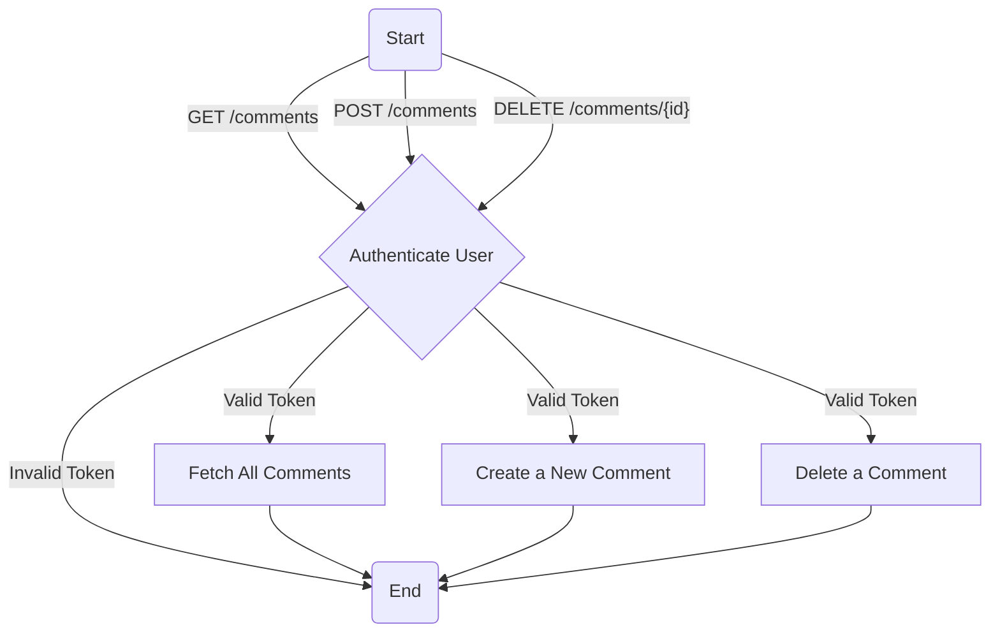
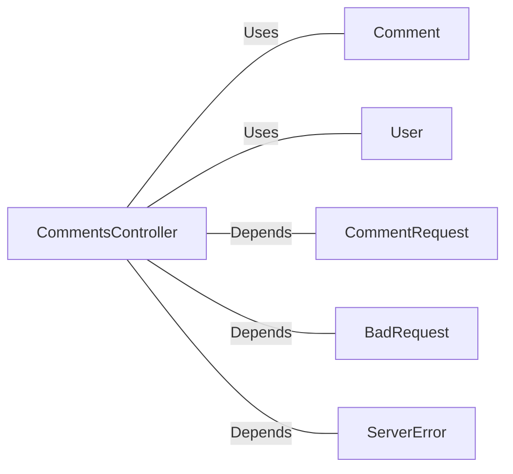

# CommentsController.java: REST API for Managing Comments

## Overview
This file defines a REST API for managing comments. It includes endpoints for retrieving, creating, and deleting comments. The API uses Spring Boot annotations for configuration and routing, and it includes basic authentication using a secret token. The `Comment` class is assumed to handle the data operations, while `CommentRequest` is a data structure for incoming requests.

## Process Flow

```mermaid
flowchart TD
    Start("Start")
    Auth{"Authenticate User"}
    FetchAll["Fetch All Comments"]
    CreateComment["Create a New Comment"]
    DeleteComment["Delete a Comment"]
    End("End")

    Start --> |"GET /comments"| Auth
    Auth --> |"Valid Token"| FetchAll
    Auth --> |"Invalid Token"| End
    FetchAll --> End

    Start --> |"POST /comments"| Auth
    Auth --> |"Valid Token"| CreateComment
    CreateComment --> End

    Start --> |"DELETE /comments/{id}"| Auth
    Auth --> |"Valid Token"| DeleteComment
    DeleteComment --> End
```

## Insights
- The API provides three main endpoints:
  - `GET /comments`: Fetches all comments.
  - `POST /comments`: Creates a new comment.
  - `DELETE /comments/{id}`: Deletes a specific comment by ID.
- Authentication is performed using a token passed in the `x-auth-token` header.
- The `@CrossOrigin(origins = "*")` annotation allows cross-origin requests from any domain, which may pose a security risk.
- The `CommentRequest` class is a simple data structure for handling incoming comment creation requests.
- Custom exceptions (`BadRequest` and `ServerError`) are defined to handle specific HTTP error responses.

## Dependencies

```mermaid
flowchart LR
    CommentsController --- |"Uses"| Comment
    CommentsController --- |"Uses"| User
    CommentsController --- |"Depends"| CommentRequest
    CommentsController --- |"Depends"| BadRequest
    CommentsController --- |"Depends"| ServerError
```

- `Comment`: Handles data operations such as fetching, creating, and deleting comments.
- `User`: Provides the `assertAuth` method for token-based authentication.
- `CommentRequest`: Represents the structure of incoming requests for creating comments.
- `BadRequest`: Custom exception for HTTP 400 errors.
- `ServerError`: Custom exception for HTTP 500 errors.

## Vulnerabilities
1. **Cross-Origin Resource Sharing (CORS) Misconfiguration**:
   - The `@CrossOrigin(origins = "*")` annotation allows requests from any origin, which can expose the API to Cross-Origin Resource Sharing (CORS) attacks.
   - **Mitigation**: Restrict the origins to trusted domains.

2. **Authentication Bypass Risk**:
   - The `User.assertAuth` method is used for authentication, but its implementation is not shown. If improperly implemented, it could allow unauthorized access.
   - **Mitigation**: Ensure robust token validation and consider using a more secure authentication mechanism like OAuth2.

3. **Lack of Input Validation**:
   - The `CommentRequest` class does not validate the `username` or `body` fields, which could lead to injection attacks or invalid data being stored.
   - **Mitigation**: Add input validation to sanitize and validate incoming data.

4. **Potential Information Disclosure**:
   - The `secret` value is injected from the application properties and could be exposed if the application is misconfigured.
   - **Mitigation**: Store sensitive configuration values securely, such as in environment variables or a secrets manager.

5. **Error Handling**:
   - The custom exceptions (`BadRequest` and `ServerError`) do not log the errors, which could make debugging difficult.
   - **Mitigation**: Implement proper logging for exceptions to aid in debugging and monitoring.

6. **No Rate Limiting**:
   - The API does not implement rate limiting, which could make it vulnerable to abuse or denial-of-service attacks.
   - **Mitigation**: Implement rate limiting to restrict the number of requests from a single client.

7. **No Authorization Checks**:
   - The API does not check if the authenticated user has the necessary permissions to create or delete comments.
   - **Mitigation**: Implement role-based access control (RBAC) or similar mechanisms to enforce authorization.
