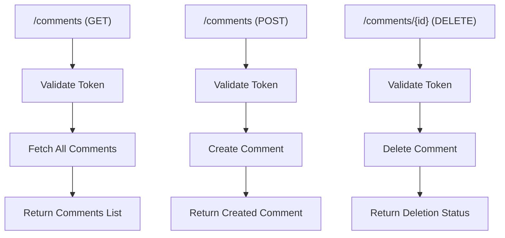
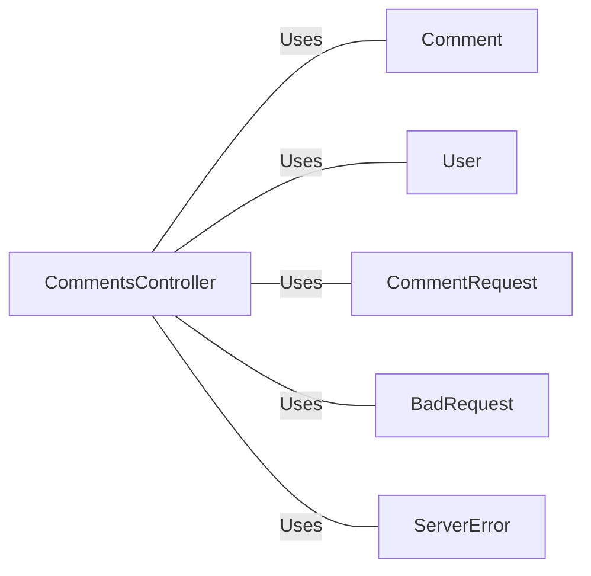

# CommentsController.java: Comments Management Controller

## Overview
The `CommentsController` class is a Spring Boot REST controller that manages comments. It provides endpoints to fetch all comments, create a new comment, and delete an existing comment. The controller also handles cross-origin requests and includes basic authentication using a token.

## Process Flow

```mermaid
flowchart TD
    A["/comments (GET)"] --> B["Validate Token"]
    B --> C["Fetch All Comments"]
    C --> D["Return Comments List"]

    E["/comments (POST)"] --> F["Validate Token"]
    F --> G["Create Comment"]
    G --> H["Return Created Comment"]

    I["/comments/{id} (DELETE)"] --> J["Validate Token"]
    J --> K["Delete Comment"]
    K --> L["Return Deletion Status"]
```

## Insights
- The controller uses Spring Boot annotations to define REST endpoints and handle HTTP requests.
- Cross-origin requests are allowed from any origin.
- Basic token-based authentication is implemented using a secret value from the application properties.
- The `CommentRequest` class is a data structure used to encapsulate the request body for creating a comment.
- Custom exceptions `BadRequest` and `ServerError` are defined to handle specific HTTP error responses.

## Dependencies

```mermaid
flowchart LR
    CommentsController --- |"Uses"| Comment
    CommentsController --- |"Uses"| User
    CommentsController --- |"Uses"| CommentRequest
    CommentsController --- |"Uses"| BadRequest
    CommentsController --- |"Uses"| ServerError
```

- `Comment`: Used for fetching, creating, and deleting comments.
- `User`: Used for asserting authentication.
- `CommentRequest`: Data structure for the request body when creating a comment.
- `BadRequest`: Custom exception for handling bad requests.
- `ServerError`: Custom exception for handling server errors.

## Vulnerabilities
- **Hardcoded Secret**: The secret value is injected from the application properties, which could be a security risk if not properly managed.
- **No Authentication on Create/Delete**: The `createComment` and `deleteComment` methods do not validate the token, which could allow unauthorized access.
- **Cross-Origin Resource Sharing (CORS)**: Allowing all origins (`*`) can be a security risk as it opens the API to potential cross-origin attacks.
