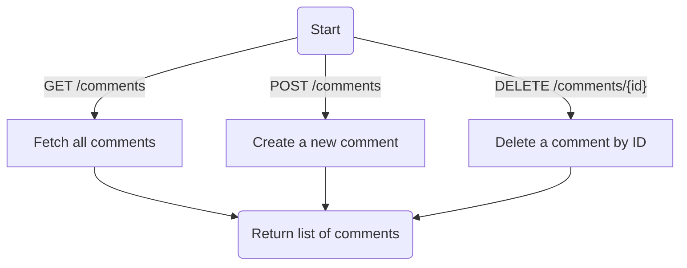
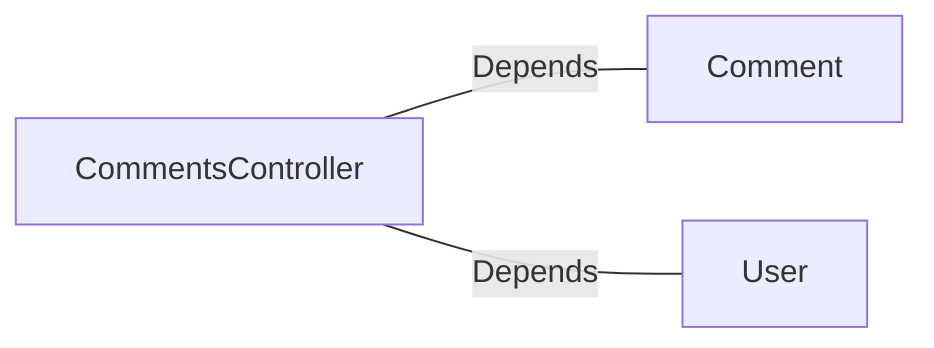

# CommentsController.java: REST API for Managing Comments

## Overview

This file defines a REST API for managing comments. It includes endpoints for retrieving, creating, and deleting comments. The API uses Spring Boot annotations to handle HTTP requests and responses. It also includes basic authentication using a token and provides custom exception handling for bad requests and server errors.

## Process Flow

```mermaid
flowchart TD
    Start("Start") --> |"GET /comments"| FetchComments["Fetch all comments"]
    FetchComments --> End("Return list of comments")
    
    Start --> |"POST /comments"| CreateComment["Create a new comment"]
    CreateComment --> End
    
    Start --> |"DELETE /comments/{id}"| DeleteComment["Delete a comment by ID"]
    DeleteComment --> End
```

## Insights

- **Authentication**: The API uses a token-based authentication mechanism. The `x-auth-token` header is validated using the `User.assertAuth` method.
- **Endpoints**:
  - `GET /comments`: Fetches all comments.
  - `POST /comments`: Creates a new comment with a username and body.
  - `DELETE /comments/{id}`: Deletes a comment by its ID.
- **CORS**: Cross-Origin Resource Sharing (CORS) is enabled for all origins (`origins = "*"`) on all endpoints.
- **Custom Exceptions**:
  - `BadRequest`: Returns a `400 Bad Request` status for client-side errors.
  - `ServerError`: Returns a `500 Internal Server Error` status for server-side errors.
- **Data Structure**:
  - `CommentRequest`: A simple data structure for handling input data when creating a comment. It includes `username` and `body` fields.

## Dependencies

```mermaid
flowchart LR
    CommentsController --- |"Depends"| Comment
    CommentsController --- |"Depends"| User
```

- `Comment`: Handles operations related to comments, such as fetching, creating, and deleting.
- `User`: Provides the `assertAuth` method for token-based authentication.

## Vulnerabilities

1. **CORS Misconfiguration**:
   - Allowing all origins (`origins = "*"`) can expose the API to Cross-Origin Resource Sharing (CORS) attacks. This is especially risky if sensitive data is being transmitted.

2. **Authentication Bypass**:
   - The `User.assertAuth` method is used for authentication, but its implementation is not provided. If this method is not robust, it could lead to authentication bypass.

3. **Lack of Input Validation**:
   - The `CommentRequest` class does not validate the `username` and `body` fields. This could lead to injection attacks (e.g., SQL injection, XSS) if the `Comment.create` method does not sanitize inputs.

4. **Error Handling**:
   - The API does not handle exceptions from the `Comment` class methods (`fetch_all`, `create`, `delete`). This could lead to unhandled exceptions and potential information leakage.

5. **Hardcoded Secret**:
   - The `@Value("${app.secret}")` annotation suggests that a secret is being loaded from configuration. If this secret is not securely stored or is hardcoded in the configuration file, it could be exposed.

6. **No Rate Limiting**:
   - The API does not implement rate limiting, making it vulnerable to brute force or denial-of-service (DoS) attacks.

## Data Manipulation (SQL)

If the `Comment` class interacts with a database, the following operations are implied:

- `fetch_all`: Likely performs a `SELECT` query to retrieve all comments.
- `create`: Likely performs an `INSERT` query to add a new comment.
- `delete`: Likely performs a `DELETE` query to remove a comment by ID.

However, the exact SQL operations are not visible in the provided code.
