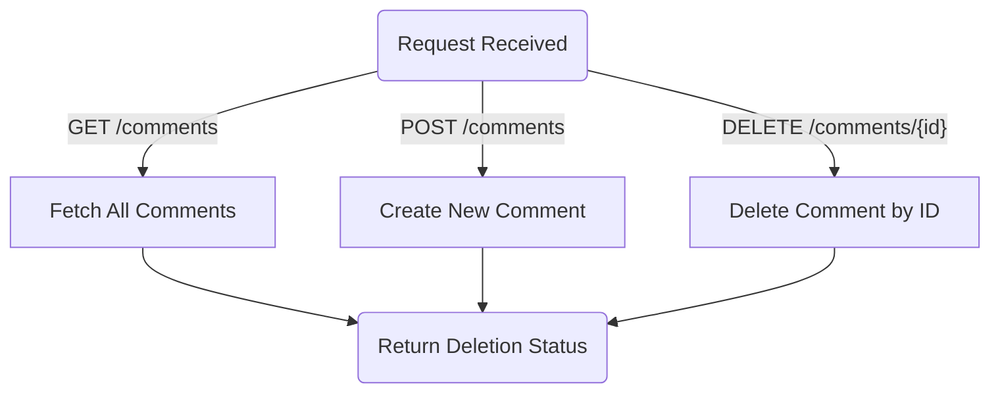
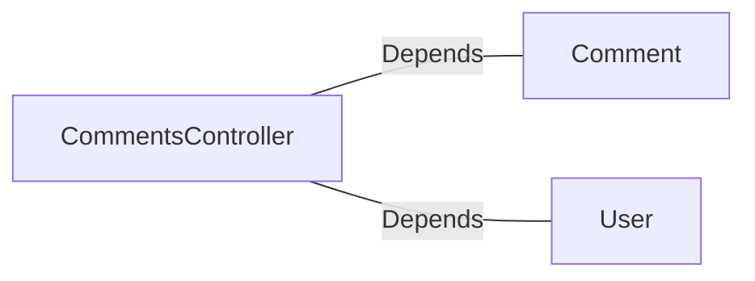

# CommentsController.java: REST API for Managing Comments

## Overview

This Java class defines a REST API for managing comments. It provides endpoints to fetch all comments, create a new comment, and delete an existing comment. The class uses Spring Boot annotations to configure the REST controller and handle HTTP requests. It also includes custom exception handling for bad requests and server errors.

## Process Flow

```mermaid
flowchart TD
    Start("Request Received") --> |"GET /comments"| FetchAllComments["Fetch All Comments"]
    FetchAllComments --> End("Return List of Comments")
    
    Start --> |"POST /comments"| CreateComment["Create New Comment"]
    CreateComment --> End("Return Created Comment")
    
    Start --> |"DELETE /comments/{id}"| DeleteComment["Delete Comment by ID"]
    DeleteComment --> End("Return Deletion Status")
```

## Insights

- **Authentication**: The `x-auth-token` header is used for authentication, validated using the `User.assertAuth` method.
- **Endpoints**:
  - `GET /comments`: Fetches all comments.
  - `POST /comments`: Creates a new comment with a username and body.
  - `DELETE /comments/{id}`: Deletes a comment by its ID.
- **CORS**: Cross-Origin Resource Sharing (CORS) is enabled for all origins (`*`) for all endpoints.
- **Custom Exceptions**:
  - `BadRequest`: Returns a `400 Bad Request` status.
  - `ServerError`: Returns a `500 Internal Server Error` status.
- **Data Model**:
  - `CommentRequest`: Represents the input for creating a comment, containing `username` and `body`.

## Dependencies

```mermaid
flowchart LR
    CommentsController --- |"Depends"| Comment
    CommentsController --- |"Depends"| User
```

- `Comment`: Handles operations related to comments, such as fetching, creating, and deleting.
- `User`: Provides the `assertAuth` method for token-based authentication.

## Vulnerabilities

1. **Hardcoded Secret**:
   - The `secret` is injected from the application properties (`@Value("${app.secret}")`). If not properly secured, it could lead to unauthorized access.

2. **CORS Misconfiguration**:
   - Allowing all origins (`*`) without restrictions can expose the API to Cross-Origin Resource Sharing (CORS) attacks.

3. **Authentication Bypass**:
   - The `User.assertAuth` method is used for authentication, but its implementation is not shown. If it is not robust, it could lead to authentication bypass.

4. **Lack of Input Validation**:
   - The `CommentRequest` fields (`username` and `body`) are not validated, which could lead to injection attacks or invalid data being processed.

5. **Error Handling**:
   - The custom exceptions (`BadRequest` and `ServerError`) are defined but not used in the controller methods, leading to potential unhandled exceptions.

6. **Mass Assignment**:
   - The `CommentRequest` object is directly deserialized from the request body, which could lead to mass assignment vulnerabilities if additional fields are added to the class.

7. **No Rate Limiting**:
   - The API does not implement rate limiting, making it vulnerable to abuse or denial-of-service (DoS) attacks.
