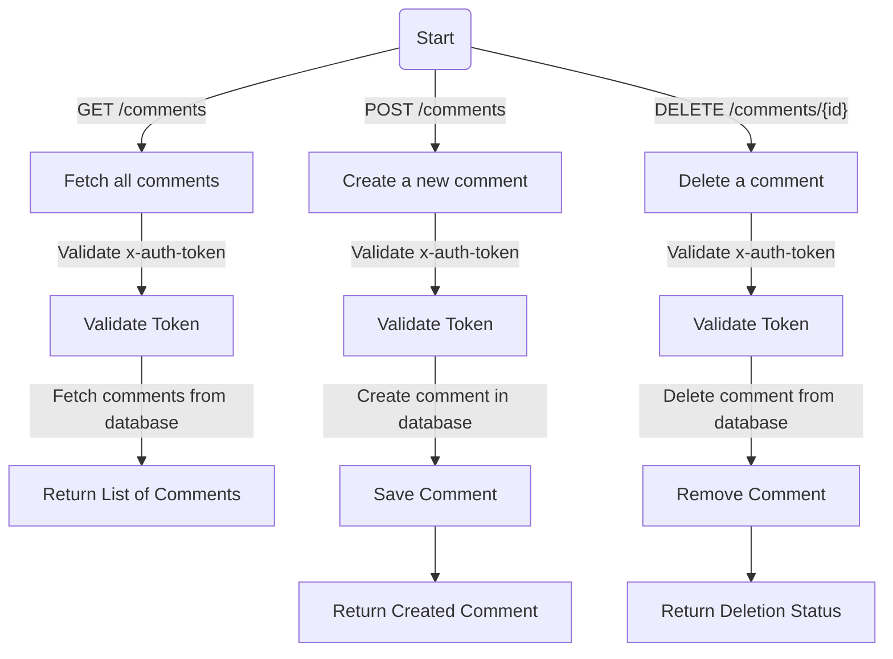
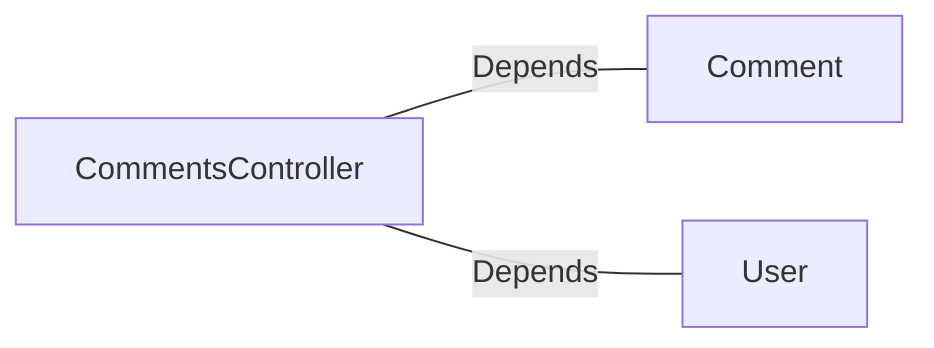

# CommentsController.java: REST API for Managing Comments

## Overview
This Java class implements a REST API for managing comments. It provides endpoints to fetch all comments, create a new comment, and delete an existing comment. The class uses Spring Boot annotations to define the controller and its endpoints. It also includes basic error handling and authentication mechanisms.

## Process Flow

```mermaid
flowchart TD
    Start("Start") --> |"GET /comments"| FetchComments["Fetch all comments"]
    FetchComments --> |"Validate x-auth-token"| ValidateToken1["Validate Token"]
    ValidateToken1 --> |"Fetch comments from database"| ReturnComments["Return List of Comments"]
    
    Start --> |"POST /comments"| CreateComment["Create a new comment"]
    CreateComment --> |"Validate x-auth-token"| ValidateToken2["Validate Token"]
    ValidateToken2 --> |"Create comment in database"| SaveComment["Save Comment"]
    SaveComment --> ReturnCreatedComment["Return Created Comment"]
    
    Start --> |"DELETE /comments/{id}"| DeleteComment["Delete a comment"]
    DeleteComment --> |"Validate x-auth-token"| ValidateToken3["Validate Token"]
    ValidateToken3 --> |"Delete comment from database"| RemoveComment["Remove Comment"]
    RemoveComment --> ReturnDeleteStatus["Return Deletion Status"]
```

## Insights
- **Endpoints**:
  - `GET /comments`: Fetches all comments.
  - `POST /comments`: Creates a new comment.
  - `DELETE /comments/{id}`: Deletes a comment by its ID.
- **Authentication**:
  - Each endpoint requires an `x-auth-token` header for authentication, validated using the `User.assertAuth` method.
- **CORS**:
  - Cross-Origin Resource Sharing (CORS) is enabled for all origins (`@CrossOrigin(origins = "*")`).
- **Error Handling**:
  - Custom exceptions `BadRequest` and `ServerError` are defined with appropriate HTTP status codes.
- **Data Model**:
  - `CommentRequest` is a simple data structure for handling incoming comment creation requests, containing `username` and `body` fields.

## Dependencies

```mermaid
flowchart LR
    CommentsController --- |"Depends"| Comment
    CommentsController --- |"Depends"| User
```

- `Comment`: Handles operations related to comments, such as fetching, creating, and deleting.
- `User`: Provides the `assertAuth` method for token validation.

### List of Identified External References
- `Comment`: Used for fetching, creating, and deleting comments.
- `User`: Used for validating the authentication token.

## Vulnerabilities
1. **Hardcoded Secret**:
   - The `secret` is injected from the application properties (`@Value("${app.secret}")`). If not properly secured, it could lead to unauthorized access.
2. **CORS Policy**:
   - Allowing all origins (`@CrossOrigin(origins = "*")`) can expose the API to Cross-Origin Resource Sharing (CORS) attacks.
3. **Authentication Bypass**:
   - The `User.assertAuth` method is used for token validation, but its implementation is not shown. If improperly implemented, it could lead to authentication bypass.
4. **Error Handling**:
   - The `BadRequest` and `ServerError` exceptions are generic and may expose sensitive information if not handled carefully.
5. **SQL Injection Risk**:
   - If the `Comment` class interacts with a database and does not use parameterized queries, it could be vulnerable to SQL injection.
6. **Lack of Input Validation**:
   - The `CommentRequest` fields (`username` and `body`) are not validated, which could lead to injection attacks or invalid data being stored.
