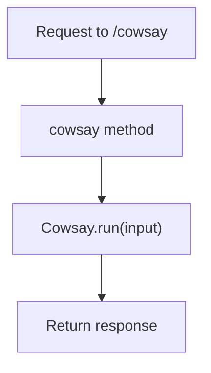
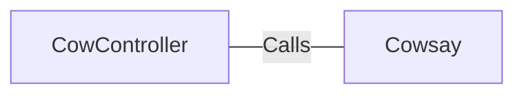

# CowController.java: Cow Controller for Cowsay Application

## Overview
The `CowController` class is a Spring Boot controller that handles HTTP requests to the `/cowsay` endpoint. It uses the `Cowsay` utility to generate a response based on the input provided by the user.

## Process Flow

## Insights
- The `CowController` class is annotated with `@RestController` and `@EnableAutoConfiguration`, making it a Spring Boot controller with automatic configuration.
- The `cowsay` method handles GET requests to the `/cowsay` endpoint and takes an optional `input` parameter with a default value of "I love Linux!".
- The method uses the `Cowsay.run(input)` function to generate the response.

## Dependencies

- `Cowsay`: The `cowsay` method calls the `Cowsay.run(input)` function to generate the response based on the input provided.

## Vulnerabilities
- **Potential Command Injection**: If the `Cowsay.run(input)` method executes system commands based on the input, it could be vulnerable to command injection attacks. Proper input validation and sanitization should be implemented to mitigate this risk.
