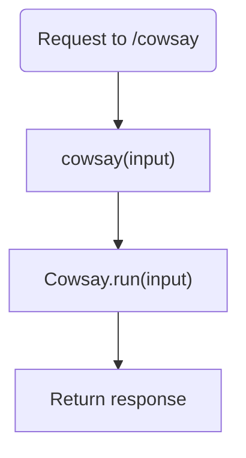
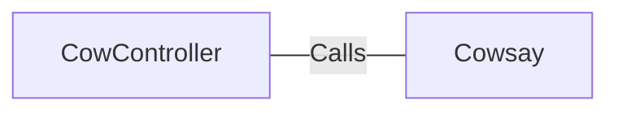

# CowController.java: Cow Controller

## Overview
The `CowController` class is a Spring Boot REST controller that handles HTTP requests to the `/cowsay` endpoint. It uses the `Cowsay` class to generate a response based on the provided input parameter.

## Process Flow

## Insights
- The `CowController` class is annotated with `@RestController` and `@EnableAutoConfiguration`, making it a Spring Boot REST controller with auto-configuration enabled.
- The `cowsay` method handles GET requests to the `/cowsay` endpoint and returns a response generated by the `Cowsay.run` method.
- The `input` parameter has a default value of "I love Linux!" if not provided in the request.

## Dependencies

- `Cowsay`: The `cowsay` method calls the `Cowsay.run` method to generate the response based on the input parameter.

## vulnerabilities
- The `cowsay` method directly uses the input parameter without any validation or sanitization, which could lead to potential security vulnerabilities such as injection attacks.
