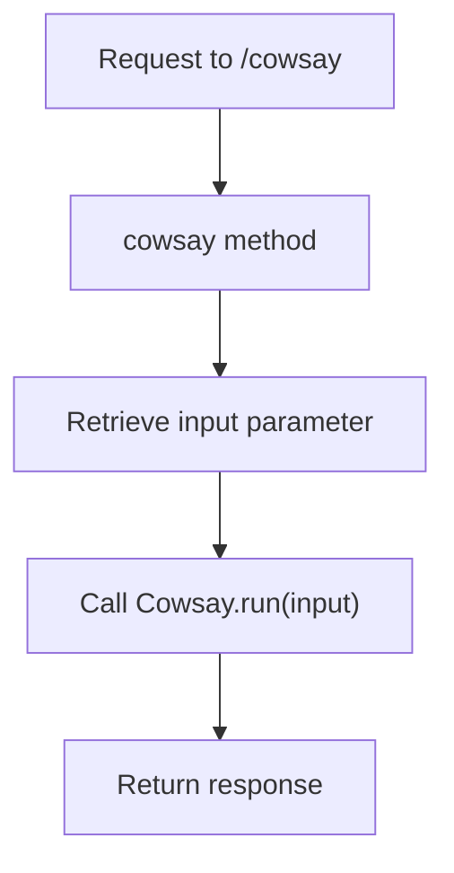
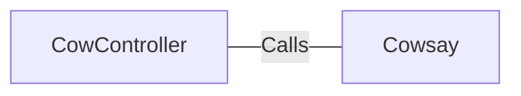

# CowController.java: Cow Controller for Cowsay Service

## Overview
The `CowController` class is a Spring Boot REST controller that handles HTTP requests to the `/cowsay` endpoint. It uses the `Cowsay` utility to generate a response based on the provided input.

## Process Flow

```mermaid
flowchart TD
    A["Request to /cowsay"] --> B["cowsay method"]
    B --> C["Retrieve input parameter"]
    C --> D["Call Cowsay.run(input)"]
    D --> E["Return response"]
```

## Insights
- The `CowController` class is annotated with `@RestController` and `@EnableAutoConfiguration`, making it a Spring Boot REST controller with automatic configuration.
- The `cowsay` method handles GET requests to the `/cowsay` endpoint.
- The `input` parameter has a default value of "I love Linux!" if not provided by the user.
- The method calls `Cowsay.run(input)` to generate the response.

## Dependencies

```mermaid
flowchart LR
    CowController --- |"Calls"| Cowsay
```

- `Cowsay`: The `cowsay` method calls the `Cowsay.run(input)` method to generate the response based on the input parameter.

## Vulnerabilities
- **Potential Command Injection**: If the `Cowsay.run(input)` method executes system commands based on the input, it could be vulnerable to command injection attacks. Proper input validation and sanitization should be implemented to mitigate this risk.
