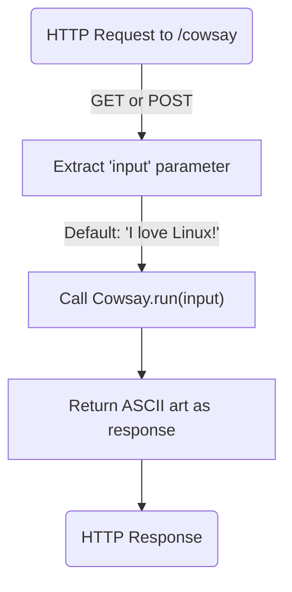
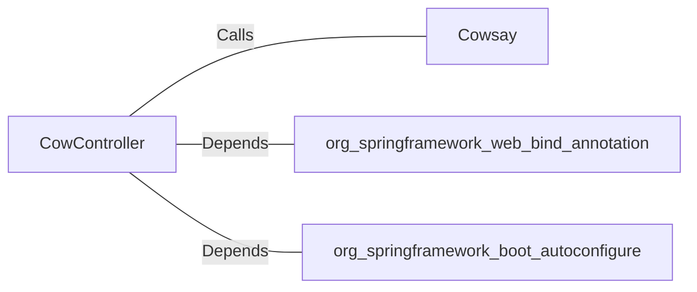

# CowController.java: REST Controller for Cowsay Functionality

## Overview
This Java class defines a REST controller that provides an endpoint for generating "cowsay" ASCII art based on user input. The controller uses Spring Boot annotations to handle HTTP requests and responses.

## Process Flow

```mermaid
flowchart TD
    Start("HTTP Request to /cowsay") --> |"GET or POST"| ProcessInput["Extract 'input' parameter"]
    ProcessInput --> |"Default: 'I love Linux!'"| CallCowsay["Call Cowsay.run(input)"]
    CallCowsay --> GenerateResponse["Return ASCII art as response"]
    GenerateResponse --> End("HTTP Response")
```

## Insights
- The `/cowsay` endpoint accepts a query parameter `input` and passes it to the `Cowsay.run()` method.
- If no `input` parameter is provided, the default value `"I love Linux!"` is used.
- The class is annotated with `@RestController` and `@EnableAutoConfiguration`, making it a Spring Boot REST controller with automatic configuration.
- The `Cowsay.run()` method is assumed to generate ASCII art, but its implementation is not provided in this snippet.

## Dependencies

```mermaid
flowchart LR
    CowController --- |"Calls"| Cowsay
    CowController --- |"Depends"| org_springframework_web_bind_annotation
    CowController --- |"Depends"| org_springframework_boot_autoconfigure
```

- `Cowsay`: Processes the `input` parameter to generate ASCII art. The exact implementation is not provided in this snippet.
- `org.springframework.web.bind.annotation`: Provides annotations like `@RestController` and `@RequestMapping` for defining REST endpoints.
- `org.springframework.boot.autoconfigure`: Enables Spring Boot's auto-configuration feature.

## Vulnerabilities
1. **Potential Command Injection**:
   - The `Cowsay.run(input)` method is called directly with user-provided input. If `Cowsay.run()` executes system commands or interacts with external processes, it could be vulnerable to command injection.
   - Mitigation: Validate and sanitize the `input` parameter before passing it to `Cowsay.run()`.

2. **Lack of Input Validation**:
   - The `input` parameter is not validated, which could lead to unexpected behavior or security issues if malicious input is provided.
   - Mitigation: Implement input validation to ensure only safe and expected values are processed.

3. **Denial of Service (DoS)**:
   - If `Cowsay.run()` has performance bottlenecks or does not handle large inputs gracefully, an attacker could exploit this to cause a denial of service.
   - Mitigation: Limit the size of the `input` parameter and handle errors gracefully.

4. **Default Input Exposure**:
   - The default value `"I love Linux!"` is hardcoded and may unintentionally expose internal preferences or information.
   - Mitigation: Use a more generic default message or allow it to be configurable.
