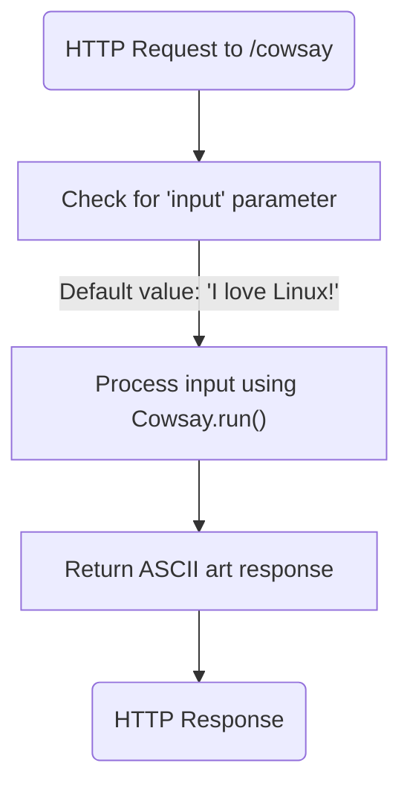
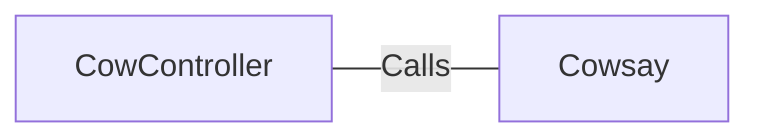

# CowController.java: REST Controller for Cowsay Functionality

## Overview
This Java class defines a REST controller for handling HTTP requests related to the "Cowsay" functionality. It provides an endpoint that takes a user input string and processes it using the `Cowsay` utility to generate a text-based ASCII art response.

## Process Flow

```mermaid
flowchart TD
    Start("HTTP Request to /cowsay") --> CheckInput["Check for 'input' parameter"]
    CheckInput --> |"Default value: 'I love Linux!'"| ProcessInput["Process input using Cowsay.run()"]
    ProcessInput --> ReturnResponse["Return ASCII art response"]
    ReturnResponse --> End("HTTP Response")
```

## Insights
- The class is annotated with `@RestController` and `@EnableAutoConfiguration`, making it a Spring Boot REST controller with automatic configuration.
- The `/cowsay` endpoint accepts a query parameter `input` with a default value of `"I love Linux!"` if no value is provided.
- The `Cowsay.run(input)` method is invoked to process the input and generate the ASCII art response.
- The `Cowsay` class is assumed to be an external utility or dependency that handles the ASCII art generation.

## Dependencies

```mermaid
flowchart LR
    CowController --- |"Calls"| Cowsay
```

- `Cowsay`: Processes the input string and generates the ASCII art response. The exact implementation of this class is not provided in the code snippet.

## Vulnerabilities
1. **Potential Command Injection**:
   - If the `Cowsay.run(input)` method executes system commands or interacts with external processes without proper sanitization, it could be vulnerable to command injection attacks.
   - User-provided input should be validated and sanitized to prevent malicious payloads.

2. **Lack of Input Validation**:
   - The `input` parameter is directly passed to the `Cowsay.run()` method without any validation. This could lead to unexpected behavior or security vulnerabilities depending on the implementation of `Cowsay`.

3. **Missing Error Handling**:
   - The code does not include error handling for potential exceptions that might occur during the execution of `Cowsay.run(input)`. This could result in unhandled exceptions and server crashes.

4. **Default Input Exposure**:
   - The default value `"I love Linux!"` might unintentionally expose internal preferences or information about the application.

## Recommendations
- Implement input validation and sanitization for the `input` parameter to prevent potential security risks.
- Add error handling to gracefully manage exceptions that may occur during the execution of `Cowsay.run(input)`.
- Review the implementation of the `Cowsay` class to ensure it is secure and does not introduce vulnerabilities.
- Consider logging and monitoring the usage of the `/cowsay` endpoint to detect and mitigate potential abuse.
