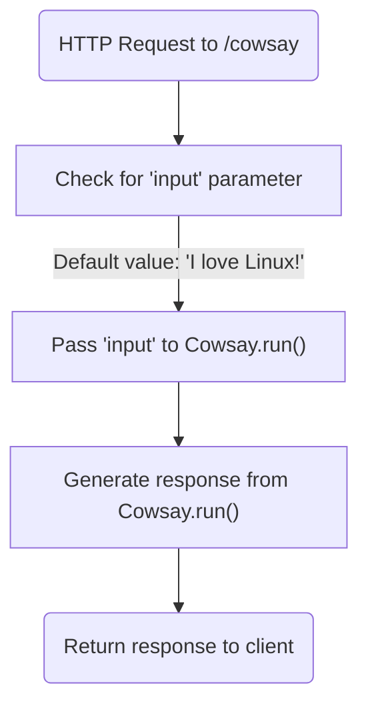
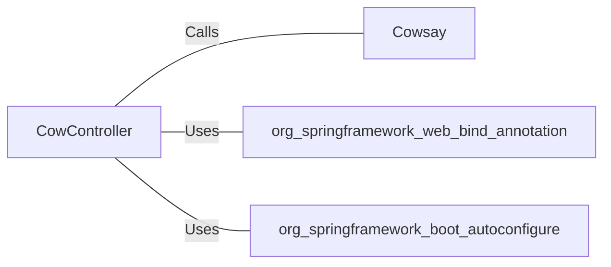

# CowController.java: REST Controller for Cowsay Functionality

## Overview
This Java class defines a REST controller for handling HTTP requests to the `/cowsay` endpoint. It uses the Spring Boot framework to expose a simple API that processes user input and generates a response using the `Cowsay` utility.

## Process Flow

```mermaid
flowchart TD
    Start("HTTP Request to /cowsay") --> CheckInput["Check for 'input' parameter"]
    CheckInput --> |"Default value: 'I love Linux!'"| ProcessInput["Pass 'input' to Cowsay.run()"]
    ProcessInput --> GenerateResponse["Generate response from Cowsay.run()"]
    GenerateResponse --> End("Return response to client")
```

## Insights
- The `/cowsay` endpoint accepts a query parameter `input` and passes it to the `Cowsay.run()` method.
- If the `input` parameter is not provided, it defaults to `"I love Linux!"`.
- The class uses Spring Boot annotations:
  - `@RestController` to define it as a REST controller.
  - `@EnableAutoConfiguration` to enable Spring Boot's auto-configuration feature.
- The `Cowsay` utility is assumed to handle the actual processing of the input and generate the response.

## Dependencies

```mermaid
flowchart LR
    CowController --- |"Calls"| Cowsay
    CowController --- |"Uses"| org_springframework_web_bind_annotation
    CowController --- |"Uses"| org_springframework_boot_autoconfigure
```

- `Cowsay`: Processes the input string and generates the response.
- `org.springframework.web.bind.annotation`: Provides annotations for mapping HTTP requests to handler methods.
- `org.springframework.boot.autoconfigure`: Enables Spring Boot's auto-configuration.

## Vulnerabilities
- **Potential Command Injection**: If the `Cowsay.run()` method executes system commands or interacts with external processes, the `input` parameter could be exploited for command injection. Proper sanitization and validation of the `input` parameter are necessary to mitigate this risk.
- **Lack of Input Validation**: The `input` parameter is directly passed to `Cowsay.run()` without any validation or sanitization, which could lead to unexpected behavior or security vulnerabilities.
- **Default Value Exposure**: The default value `"I love Linux!"` might unintentionally expose internal preferences or assumptions about the application.
