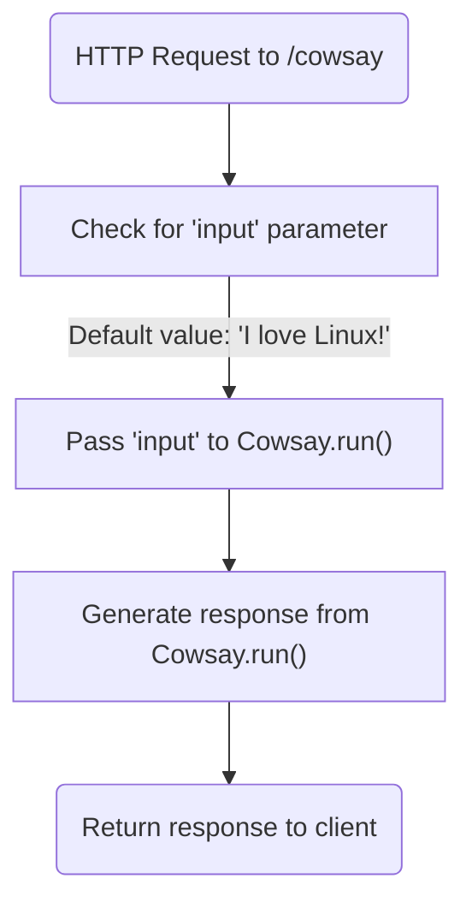
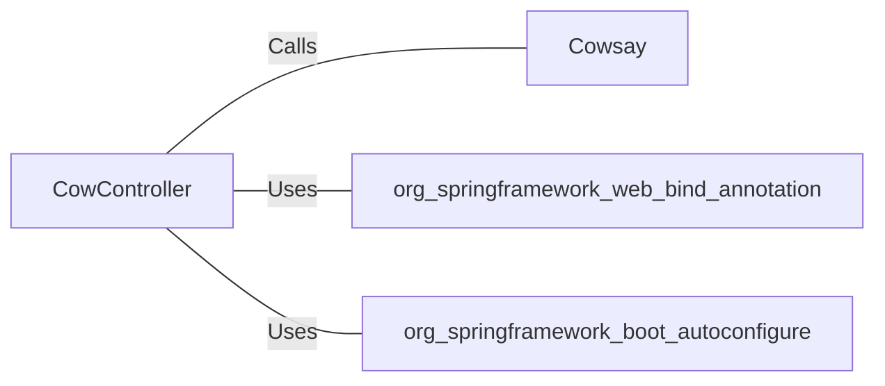

# CowController.java: REST Controller for Cowsay Functionality

## Overview
This Java class defines a REST controller for handling HTTP requests to the `/cowsay` endpoint. It uses the Spring Boot framework to expose a simple API that processes user input and generates a response using the `Cowsay` utility.

## Process Flow

```mermaid
flowchart TD
    Start("HTTP Request to /cowsay") --> CheckInput["Check for 'input' parameter"]
    CheckInput --> |"Default value: 'I love Linux!'"| ProcessInput["Pass 'input' to Cowsay.run()"]
    ProcessInput --> GenerateResponse["Generate response from Cowsay.run()"]
    GenerateResponse --> End("Return response to client")
```

## Insights
- The `/cowsay` endpoint accepts a query parameter `input` and passes it to the `Cowsay.run()` method.
- If the `input` parameter is not provided, it defaults to `"I love Linux!"`.
- The class uses Spring Boot annotations:
  - `@RestController` to define it as a REST controller.
  - `@EnableAutoConfiguration` to enable Spring Boot's auto-configuration feature.
- The `Cowsay.run()` method is assumed to generate a response based on the provided input.

## Dependencies

```mermaid
flowchart LR
    CowController --- |"Calls"| Cowsay
    CowController --- |"Uses"| org_springframework_web_bind_annotation
    CowController --- |"Uses"| org_springframework_boot_autoconfigure
```

- `Cowsay`: Processes the input string and generates the response. The exact implementation of `Cowsay` is not provided in this code snippet.
- `org.springframework.web.bind.annotation`: Provides annotations like `@RestController` and `@RequestMapping` for defining REST endpoints.
- `org.springframework.boot.autoconfigure`: Enables Spring Boot's auto-configuration.

## Vulnerabilities
1. **Potential Command Injection**:
   - The `input` parameter is directly passed to `Cowsay.run()` without any validation or sanitization. If `Cowsay.run()` executes system commands or interacts with external processes, this could lead to command injection vulnerabilities.
   - **Mitigation**: Validate and sanitize the `input` parameter to ensure it does not contain malicious content.

2. **Denial of Service (DoS)**:
   - If `Cowsay.run()` performs resource-intensive operations, an attacker could exploit this by sending large or complex inputs, potentially leading to a denial of service.
   - **Mitigation**: Implement input size limits and rate limiting for the endpoint.

3. **Default Input Exposure**:
   - The default value `"I love Linux!"` might unintentionally expose internal preferences or information.
   - **Mitigation**: Use a more neutral default value or require the `input` parameter to be explicitly provided.

4. **Lack of Authentication/Authorization**:
   - The endpoint is publicly accessible without any authentication or authorization checks.
   - **Mitigation**: Implement authentication and authorization mechanisms to restrict access to the endpoint if necessary.
