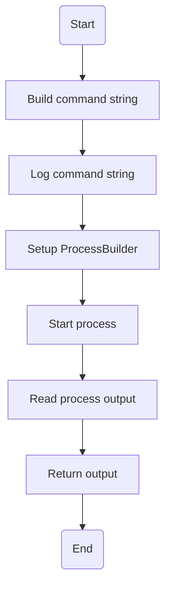

# Cowsay.java: Command Execution with Cowsay

## Overview
The `Cowsay` class is responsible for executing the `cowsay` command with a given input string. It constructs a command string, runs it using a `ProcessBuilder`, and captures the output.

## Process Flow

## Insights
- The `run` method constructs a command string to execute `cowsay` with the provided input.
- The command string is logged to the console.
- The `ProcessBuilder` is used to execute the command in a bash shell.
- The output of the command is read line by line and appended to a `StringBuilder`.
- Any exceptions during the process execution are caught and printed to the stack trace.

## Vulnerabilities
- **Command Injection**: The input string is directly concatenated into the command string without any sanitization, making the code vulnerable to command injection attacks. An attacker could inject arbitrary commands by manipulating the input string.
