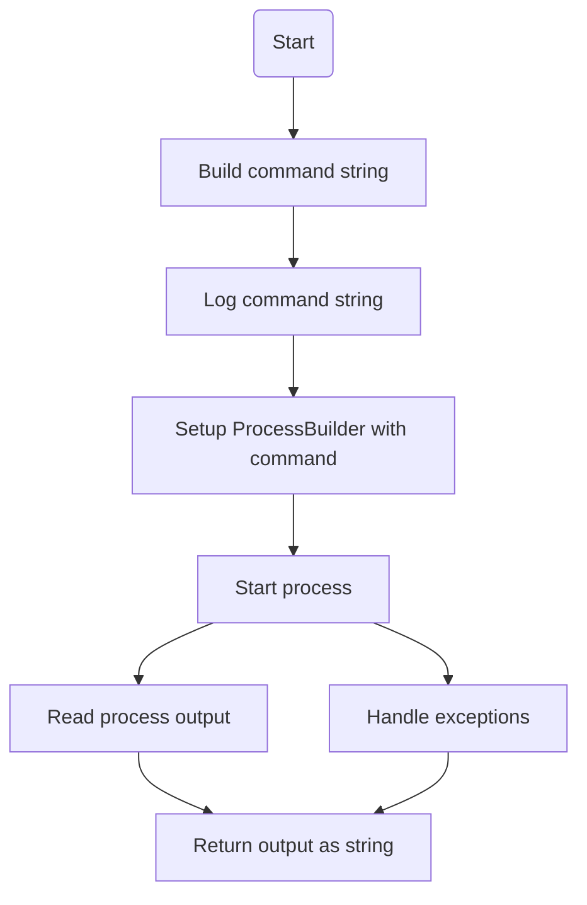
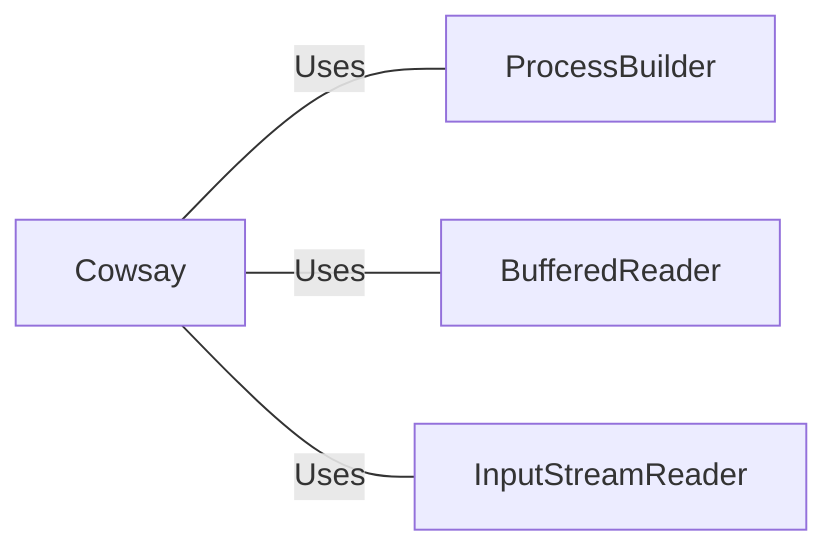

# Cowsay.java: Cowsay Command Executor

## Overview
The `Cowsay` class is responsible for executing the `cowsay` command with a given input string. It uses a `ProcessBuilder` to run the command in a bash shell and captures the output.

## Process Flow

## Insights
- The class uses `ProcessBuilder` to execute the `cowsay` command.
- The command is constructed by concatenating the input string directly, which can lead to command injection vulnerabilities.
- The output of the command is read line by line and appended to a `StringBuilder`.
- Exceptions are caught and printed to the standard error stream.

## Vulnerabilities
- **Command Injection**: The input string is directly concatenated into the command string without any sanitization, making it vulnerable to command injection attacks. An attacker could inject arbitrary commands by manipulating the input string. 

## Dependencies

- `ProcessBuilder`: Used to create and start the process for executing the command.
- `BufferedReader`: Used to read the output of the executed command.
- `InputStreamReader`: Used to convert the input stream of the process to a reader.
