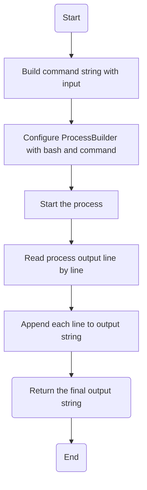
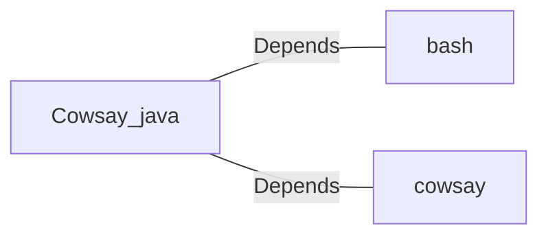

# Cowsay.java: Command Execution Wrapper for Cowsay

## Overview

This program provides a wrapper for executing the `cowsay` command-line utility, which generates ASCII art of a cow saying a given input message. The program uses Java's `ProcessBuilder` to execute the command and capture its output.

## Process Flow

```mermaid
flowchart TD
    Start("Start") --> BuildCommand["Build command string with input"]
    BuildCommand --> ConfigureProcess["Configure ProcessBuilder with bash and command"]
    ConfigureProcess --> StartProcess["Start the process"]
    StartProcess --> ReadOutput["Read process output line by line"]
    ReadOutput --> AppendOutput["Append each line to output string"]
    AppendOutput --> ReturnOutput("Return the final output string")
    ReturnOutput --> End("End")
```

## Insights

- The program dynamically constructs a shell command to execute the `cowsay` utility.
- It uses `ProcessBuilder` to execute the command and capture its output.
- The program does not sanitize the input, which could lead to command injection vulnerabilities.
- The output of the `cowsay` command is read line by line and appended to a `StringBuilder`.

## Vulnerabilities

1. **Command Injection**:
   - The input string is directly concatenated into the command without sanitization. This allows an attacker to inject arbitrary shell commands by providing malicious input.
   - Example: If the input is `"; rm -rf / #"`, the resulting command becomes `/usr/games/cowsay '; rm -rf / #'`, which could execute destructive commands.

2. **Error Handling**:
   - The program catches exceptions and prints the stack trace but does not handle errors gracefully or provide meaningful feedback to the caller.

3. **Dependency on External Command**:
   - The program assumes the presence of the `cowsay` utility at `/usr/games/cowsay`. If the utility is not installed or located elsewhere, the program will fail.

## Dependencies

```mermaid
flowchart LR
    Cowsay_java --- |"Depends"| bash
    Cowsay_java --- |"Depends"| cowsay
```

- `bash`: Used to execute the constructed shell command.
- `cowsay`: The external utility that generates ASCII art of a cow saying the input message.

## Recommendations

- **Input Sanitization**:
  - Validate and sanitize the input to prevent command injection. Avoid directly concatenating user input into shell commands.
  - Use safer alternatives like passing arguments to `ProcessBuilder` instead of constructing a single command string.

- **Error Handling**:
  - Implement proper error handling to provide meaningful feedback to the caller in case of failures.

- **Dependency Management**:
  - Check for the presence of the `cowsay` utility at runtime and provide a fallback or error message if it is not available.
