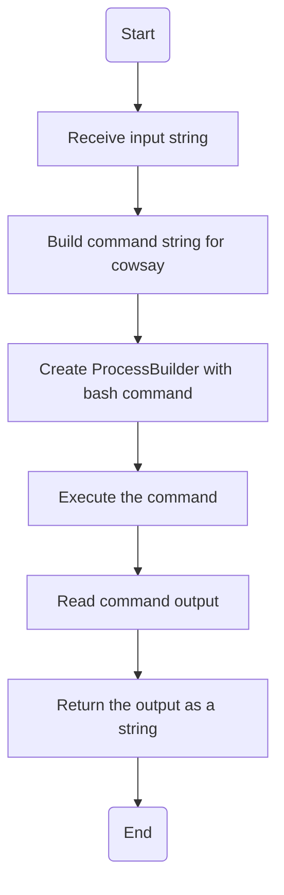
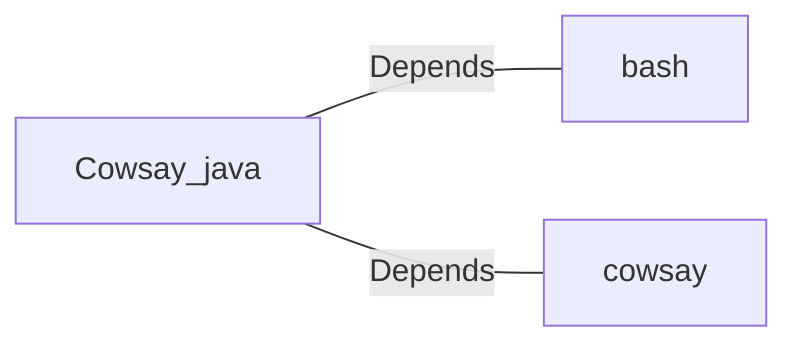

# Cowsay.java: Command Execution Wrapper for Cowsay

## Overview

This program provides a wrapper for executing the `cowsay` command-line utility, which generates ASCII art of a cow saying a given input message. The program uses Java's `ProcessBuilder` to execute the command and capture its output.

## Process Flow

```mermaid
flowchart TD
    Start("Start")
    Input["Receive input string"]
    BuildCommand["Build command string for cowsay"]
    CreateProcess["Create ProcessBuilder with bash command"]
    ExecuteCommand["Execute the command"]
    ReadOutput["Read command output"]
    ReturnOutput["Return the output as a string"]
    End("End")

    Start --> Input
    Input --> BuildCommand
    BuildCommand --> CreateProcess
    CreateProcess --> ExecuteCommand
    ExecuteCommand --> ReadOutput
    ReadOutput --> ReturnOutput
    ReturnOutput --> End
```

## Insights

- The program dynamically constructs a shell command to execute the `cowsay` utility.
- It uses `ProcessBuilder` to execute the command and capture its output.
- The program does not sanitize the input, which could lead to command injection vulnerabilities.
- The output of the `cowsay` command is read line by line and appended to a `StringBuilder`.

## Vulnerabilities

1. **Command Injection**:
   - The input string is directly concatenated into the command string without any sanitization or validation.
   - An attacker could inject malicious shell commands into the input, leading to arbitrary command execution.
   - Example: If the input is `"; rm -rf /"`, the resulting command would execute `rm -rf /` on the system.

2. **Error Handling**:
   - The program catches exceptions but only prints the stack trace. It does not provide meaningful error handling or feedback to the caller.

3. **Dependency on External Command**:
   - The program relies on the presence of the `cowsay` utility at `/usr/games/cowsay`. If the utility is not installed or located at a different path, the program will fail.

## Dependencies

```mermaid
flowchart LR
    Cowsay_java --- |"Depends"| bash
    Cowsay_java --- |"Depends"| cowsay
```

- `bash`: Used to execute the constructed shell command.
- `cowsay`: The external utility that generates ASCII art.

## Recommendations

- **Input Sanitization**: Validate and sanitize the input to prevent command injection.
- **Use Safer APIs**: Instead of constructing shell commands, use APIs or libraries that directly interact with the `cowsay` utility, if available.
- **Error Handling**: Improve error handling to provide meaningful feedback to the caller.
- **Dependency Management**: Check for the presence of the `cowsay` utility and handle cases where it is not available.
