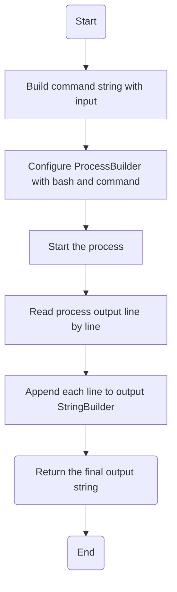
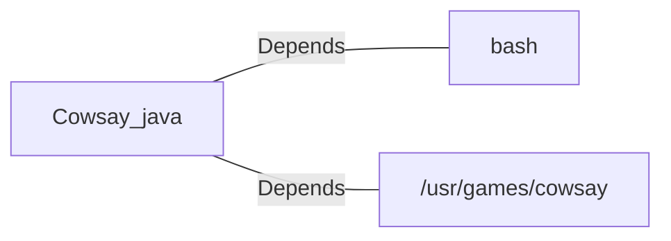

# Cowsay.java: Command Execution Wrapper for Cowsay

## Overview

This program provides a wrapper for executing the `cowsay` command-line utility, which generates ASCII art of a cow saying a given input message. The program uses Java's `ProcessBuilder` to execute the command and capture its output.

## Process Flow

```mermaid
flowchart TD
    Start("Start") --> BuildCommand["Build command string with input"]
    BuildCommand --> ConfigureProcessBuilder["Configure ProcessBuilder with bash and command"]
    ConfigureProcessBuilder --> StartProcess["Start the process"]
    StartProcess --> ReadOutput["Read process output line by line"]
    ReadOutput --> AppendOutput["Append each line to output StringBuilder"]
    AppendOutput --> ReturnOutput("Return the final output string")
    ReturnOutput --> End("End")
```

## Insights

- The program dynamically constructs a shell command to execute the `cowsay` utility.
- It uses `ProcessBuilder` to execute the command and capture its output.
- The program does not sanitize the `input` parameter, which could lead to command injection vulnerabilities.
- The output of the `cowsay` command is read line by line and appended to a `StringBuilder`.

## Vulnerabilities

1. **Command Injection**:
   - The `input` parameter is directly concatenated into the command string without any sanitization or validation.
   - An attacker could inject malicious shell commands through the `input` parameter, leading to arbitrary command execution.
   - Example: If `input` is set to `"; rm -rf /"`, the resulting command would execute `cowsay` and then delete the root directory.

2. **Error Handling**:
   - The program catches exceptions but only prints the stack trace. It does not provide meaningful error messages or handle errors gracefully.

3. **Dependency on External Command**:
   - The program relies on the presence of the `cowsay` utility at `/usr/games/cowsay`. If the utility is not installed or the path is incorrect, the program will fail.

## Dependencies

```mermaid
flowchart LR
    Cowsay_java --- |"Depends"| bash["bash"]
    Cowsay_java --- |"Depends"| cowsay["/usr/games/cowsay"]
```

- `bash`: Used to execute the constructed shell command.
- `/usr/games/cowsay`: The external `cowsay` utility that generates ASCII art.

## Recommendations

- **Input Sanitization**:
  - Validate and sanitize the `input` parameter to prevent command injection.
  - Use a safer method to pass arguments to `ProcessBuilder`, such as providing them as separate elements in the `command` list.

- **Error Handling**:
  - Implement proper error handling to provide meaningful feedback to the user.

- **Dependency Check**:
  - Verify the presence of the `cowsay` utility at runtime and provide a fallback or error message if it is not available.
