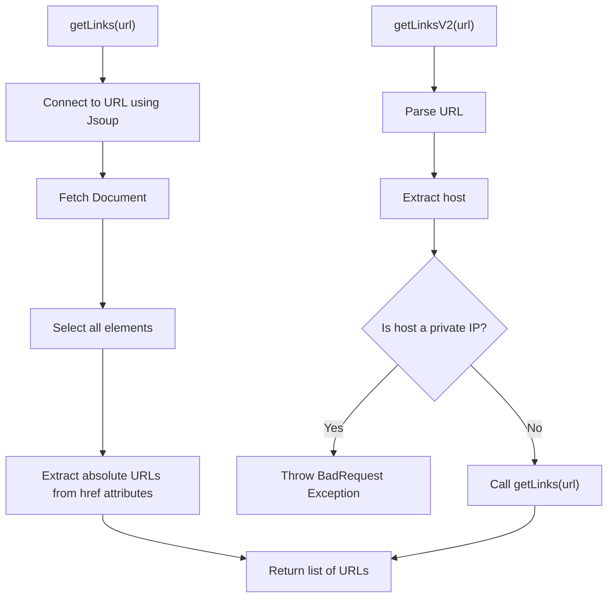
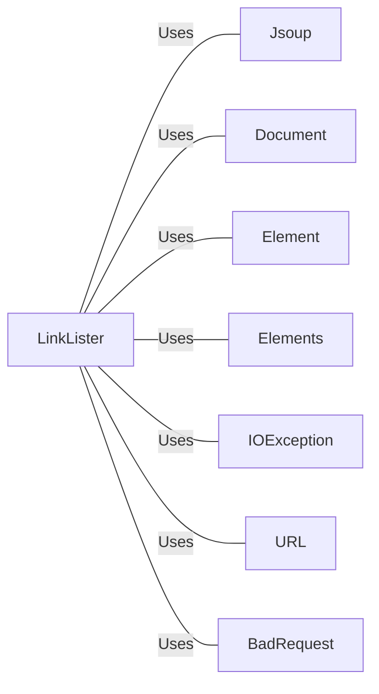

# LinkLister.java: Link Extraction Utility

## Overview
The `LinkLister` class provides methods to extract all hyperlinks from a given URL. It includes two methods: `getLinks` and `getLinksV2`. The `getLinks` method fetches all hyperlinks from the provided URL, while `getLinksV2` adds an additional layer of validation to prevent the use of private IP addresses.

## Process Flow

## Insights
- The `getLinks` method uses the Jsoup library to connect to the provided URL and extract all hyperlinks.
- The `getLinksV2` method adds a security check to prevent the use of private IP addresses, throwing a `BadRequest` exception if a private IP is detected.
- The `getLinksV2` method relies on the `getLinks` method for the actual extraction of hyperlinks after validating the URL.

## Dependencies

- `Jsoup`: Used to connect to the URL and parse the HTML document.
- `Document`: Represents the parsed HTML document.
- `Element`: Represents an HTML element.
- `Elements`: Represents a list of HTML elements.
- `IOException`: Handles input/output exceptions.
- `URL`: Used to parse and validate the URL.
- `BadRequest`: Custom exception used to handle invalid requests.

## Vulnerabilities
- **Potential SSRF (Server-Side Request Forgery)**: The `getLinks` method directly connects to the provided URL without any validation, which could be exploited to perform SSRF attacks.
- **Private IP Address Exposure**: Although `getLinksV2` checks for private IP addresses, the `getLinks` method does not, making it vulnerable if used directly.
- **Exception Handling**: The `getLinksV2` method catches all exceptions and throws a `BadRequest` exception with the message from the caught exception. This could potentially expose internal error messages.
