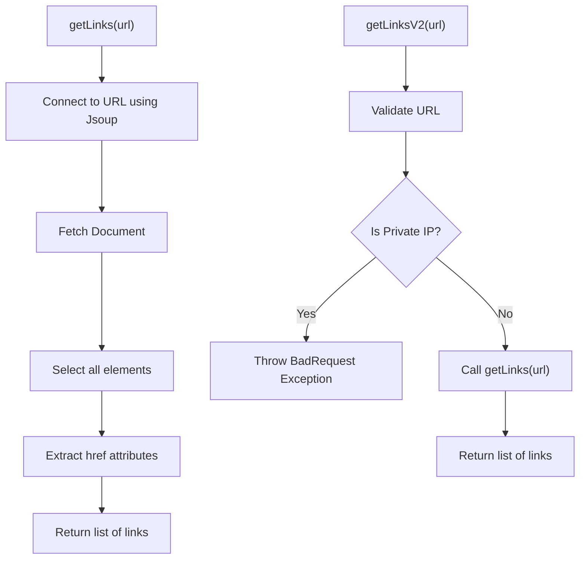
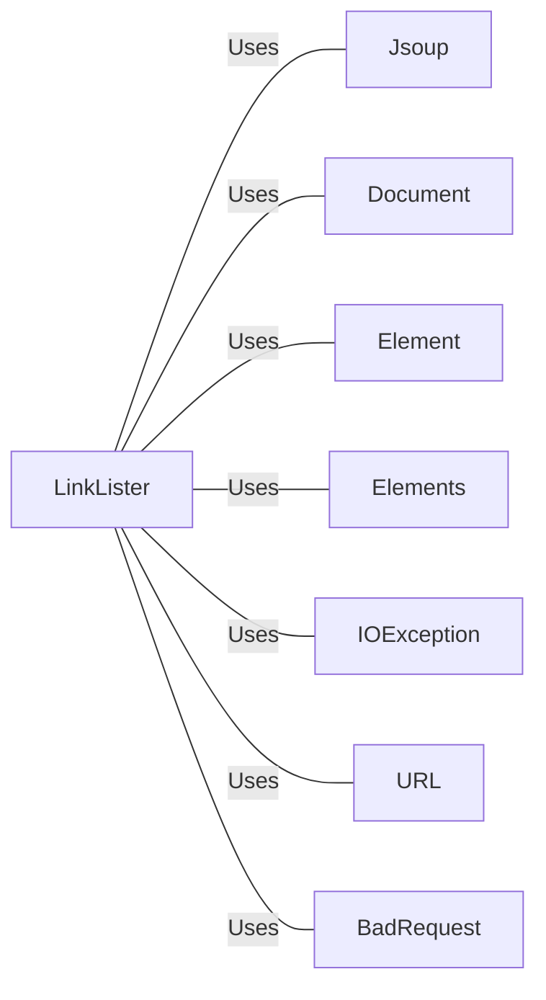

# LinkLister.java: Link Extraction Utility

## Overview
The `LinkLister` class provides functionality to extract all hyperlinks from a given URL. It includes methods to fetch links from a webpage and an enhanced version that checks for private IP addresses to prevent misuse.

## Process Flow

## Insights
- The `getLinks` method uses Jsoup to connect to a URL and extract all hyperlinks.
- The `getLinksV2` method adds a layer of validation to prevent fetching links from private IP addresses.
- The `getLinksV2` method throws a `BadRequest` exception if the URL points to a private IP address.

## Dependencies

- `Jsoup`: Used to connect to the URL and parse the HTML document.
- `Document`: Represents the HTML document fetched from the URL.
- `Element`: Represents an HTML element.
- `Elements`: Represents a list of HTML elements.
- `IOException`: Handles input/output exceptions.
- `URL`: Used to parse and validate the URL.
- `BadRequest`: Custom exception thrown when a private IP address is detected.

## Vulnerabilities
- **Private IP Address Exposure**: The `getLinksV2` method checks for private IP addresses but does not handle all possible private IP ranges. This could be exploited to access internal network resources.
- **Exception Handling**: The `getLinksV2` method catches all exceptions and throws a `BadRequest` with the exception message. This could expose sensitive information about the internal workings of the application.
