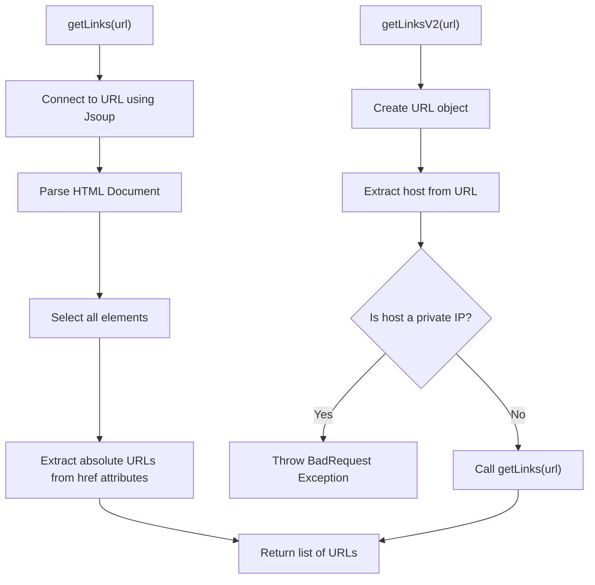
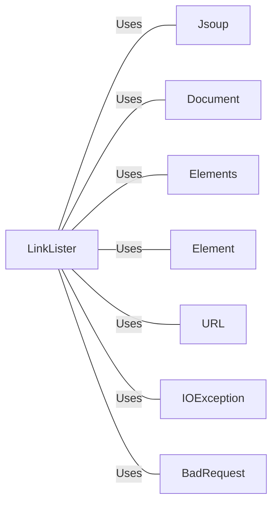

# LinkLister.java: URL Link Extractor

## Overview
The `LinkLister` class is responsible for extracting all hyperlinks from a given URL. It provides two methods for this purpose: `getLinks` and `getLinksV2`. The latter includes additional validation to prevent the use of private IP addresses.

## Process Flow

## Insights
- The `getLinks` method uses Jsoup to connect to the provided URL, parse the HTML document, and extract all hyperlinks.
- The `getLinksV2` method adds a layer of validation to ensure the URL does not point to a private IP address before calling `getLinks`.
- The `getLinksV2` method throws a `BadRequest` exception if the URL points to a private IP address or if any other error occurs during processing.

## Dependencies

- `Jsoup`: Used to connect to the URL and parse the HTML document.
- `Document`: Represents the parsed HTML document.
- `Elements`: Represents a collection of HTML elements.
- `Element`: Represents a single HTML element.
- `URL`: Used to create a URL object for validation.
- `IOException`: Handles input/output exceptions.
- `BadRequest`: Custom exception thrown for invalid requests.

## Vulnerabilities
- **Private IP Address Exposure**: The `getLinks` method does not validate the URL, potentially allowing access to private IP addresses. This is mitigated in `getLinksV2`.
- **Exception Handling**: The `getLinksV2` method catches all exceptions and throws a `BadRequest` exception with the message from the caught exception. This could expose internal error messages to the user.
