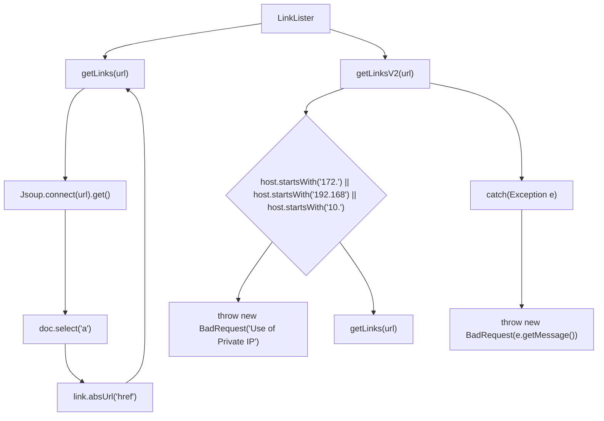
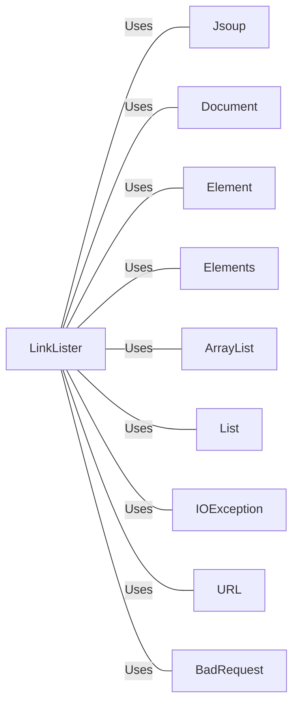

# LinkLister.java: Link Extraction Utility

## Overview
The `LinkLister` class provides functionality to extract hyperlinks from a given URL. It includes methods to fetch all links from a webpage and a version that validates the URL to prevent the use of private IP addresses.

## Process Flow

## Insights
- The `getLinks` method uses Jsoup to connect to the provided URL and fetch all hyperlinks (`<a>` tags) from the webpage.
- The `getLinksV2` method adds validation to ensure the URL does not point to a private IP address before fetching the links.
- The `getLinksV2` method throws a `BadRequest` exception if the URL is invalid or points to a private IP address.

## Dependencies

- `Jsoup`: Used to connect to the URL and parse the HTML document.
- `Document`: Represents the parsed HTML document.
- `Element`: Represents an HTML element.
- `Elements`: Represents a collection of HTML elements.
- `ArrayList`: Used to store the list of links.
- `List`: Interface for the list of links.
- `IOException`: Exception thrown for input/output errors.
- `URL`: Used to parse the URL and extract the host.
- `BadRequest`: Custom exception thrown for invalid URLs or private IP addresses.

## Vulnerabilities
- **Private IP Address Exposure**: The `getLinksV2` method checks for private IP addresses but does not validate other potentially dangerous IP ranges or domains.
- **Exception Handling**: The `getLinksV2` method catches all exceptions and throws a `BadRequest` with the exception message, which might expose internal error details.
