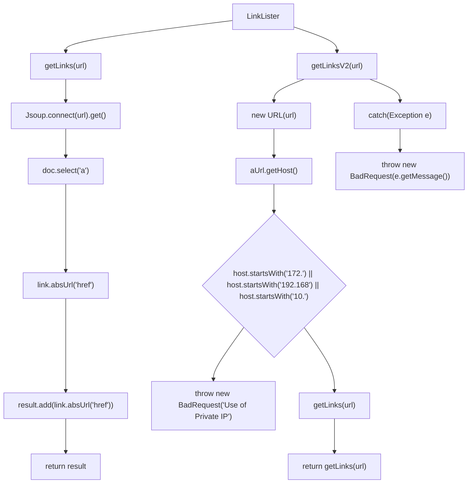
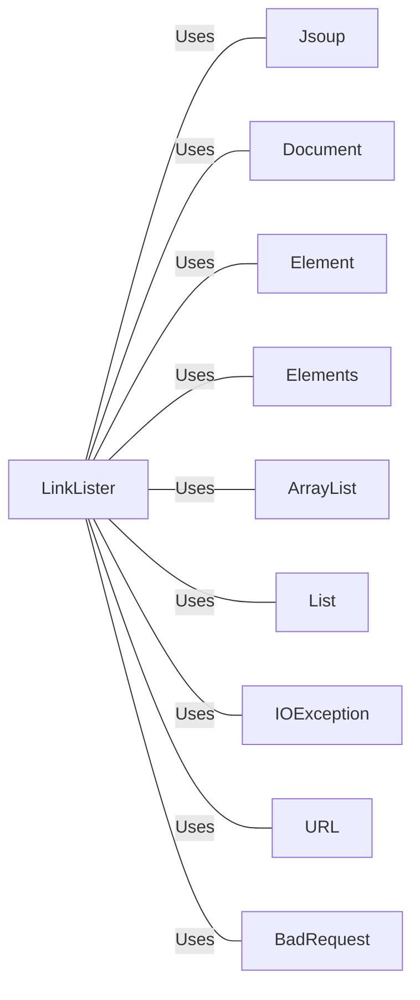

# LinkLister.java: Link Extraction Utility

## Overview
The `LinkLister` class is responsible for extracting hyperlinks from a given URL. It provides two methods for this purpose: `getLinks` and `getLinksV2`. The first method retrieves all links from the specified URL, while the second method includes additional validation to prevent the use of private IP addresses.

## Process Flow

```mermaid
flowchart TD
    A["LinkLister"]
    B["getLinks(url)"]
    C["Jsoup.connect(url).get()"]
    D["doc.select('a')"]
    E["link.absUrl('href')"]
    F["result.add(link.absUrl('href'))"]
    G["return result"]
    H["getLinksV2(url)"]
    I["new URL(url)"]
    J["aUrl.getHost()"]
    K{"host.startsWith('172.') || host.startsWith('192.168') || host.startsWith('10.')"}
    L["throw new BadRequest('Use of Private IP')"]
    M["getLinks(url)"]
    N["return getLinks(url)"]
    O["catch(Exception e)"]
    P["throw new BadRequest(e.getMessage())"]

    A --> B
    B --> C
    C --> D
    D --> E
    E --> F
    F --> G
    A --> H
    H --> I
    I --> J
    J --> K
    K --> L
    K --> M
    M --> N
    H --> O
    O --> P
```

## Insights
- The `getLinks` method uses Jsoup to connect to the provided URL and extract all hyperlinks.
- The `getLinksV2` method adds a validation step to check if the URL's host is a private IP address, throwing a `BadRequest` exception if it is.
- The `getLinksV2` method also handles exceptions by catching them and throwing a `BadRequest` exception with the error message.

## Dependencies

```mermaid
flowchart LR
    LinkLister --- |"Uses"| Jsoup
    LinkLister --- |"Uses"| Document
    LinkLister --- |"Uses"| Element
    LinkLister --- |"Uses"| Elements
    LinkLister --- |"Uses"| ArrayList
    LinkLister --- |"Uses"| List
    LinkLister --- |"Uses"| IOException
    LinkLister --- |"Uses"| URL
    LinkLister --- |"Uses"| BadRequest
```
- `Jsoup`: Used to connect to the URL and parse the HTML document.
- `Document`: Represents the parsed HTML document.
- `Element`: Represents an HTML element.
- `Elements`: Represents a collection of HTML elements.
- `ArrayList`: Used to store the list of links.
- `List`: Interface for the list of links.
- `IOException`: Exception thrown for input/output errors.
- `URL`: Used to parse the URL and extract the host.
- `BadRequest`: Custom exception thrown for invalid requests.

## Vulnerabilities
- **Potential SSRF (Server-Side Request Forgery)**: The `getLinks` method directly connects to the provided URL without any validation, which could be exploited to make the server connect to internal services.
- **Private IP Address Exposure**: The `getLinksV2` method attempts to prevent private IP address usage but does not cover all private IP ranges (e.g., `127.0.0.1` loopback address).
- **Exception Handling**: The `getLinksV2` method catches all exceptions and throws a `BadRequest` with the exception message, which could expose internal error details to the client.
