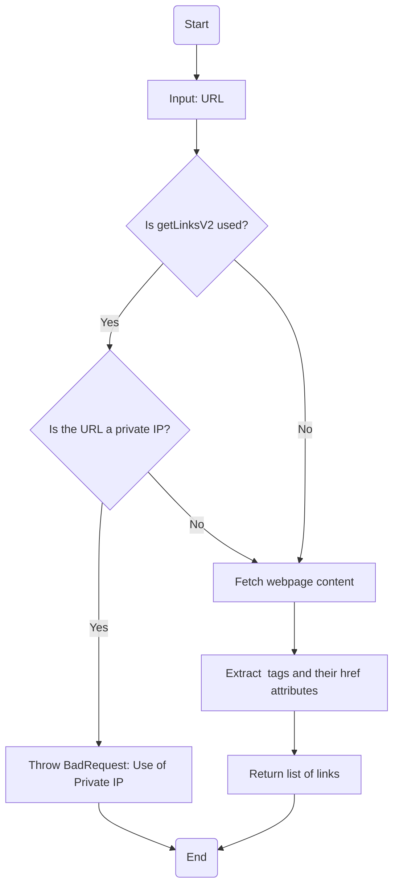
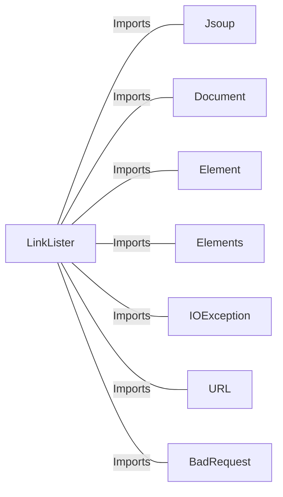

# LinkLister.java: Webpage Link Extractor

## Overview

The `LinkLister` class is designed to extract all hyperlinks (`<a>` tags) from a given webpage URL. It provides two methods for this purpose:
1. `getLinks(String url)`: Extracts all hyperlinks from the provided URL.
2. `getLinksV2(String url)`: Adds a security check to prevent the extraction of links from private IP addresses.

## Process Flow

```mermaid
flowchart TD
    Start("Start")
    InputURL["Input: URL"]
    CheckV2{"Is getLinksV2 used?"}
    ValidateIP{"Is the URL a private IP?"}
    ThrowError["Throw BadRequest: Use of Private IP"]
    FetchLinks["Fetch webpage content"]
    ExtractLinks["Extract <a> tags and their href attributes"]
    ReturnLinks["Return list of links"]
    End("End")

    Start --> InputURL --> CheckV2
    CheckV2 --> |"Yes"| ValidateIP
    CheckV2 --> |"No"| FetchLinks
    ValidateIP --> |"Yes"| ThrowError --> End
    ValidateIP --> |"No"| FetchLinks
    FetchLinks --> ExtractLinks --> ReturnLinks --> End
```

## Insights

- **Core Functionality**: The class uses the `Jsoup` library to parse HTML content and extract hyperlinks.
- **Security Enhancement**: The `getLinksV2` method includes a check to block URLs pointing to private IP ranges (`172.*`, `192.168.*`, `10.*`), mitigating potential security risks.
- **Error Handling**: The `getLinksV2` method wraps exceptions in a custom `BadRequest` exception, providing a more descriptive error message.
- **Reusability**: The `getLinks` method is reused in `getLinksV2` after the private IP validation.

## Dependencies

```mermaid
flowchart LR
    LinkLister --- |"Imports"| Jsoup
    LinkLister --- |"Imports"| Document
    LinkLister --- |"Imports"| Element
    LinkLister --- |"Imports"| Elements
    LinkLister --- |"Imports"| IOException
    LinkLister --- |"Imports"| URL
    LinkLister --- |"Imports"| BadRequest
```

- `Jsoup`: Used for parsing HTML and extracting elements.
- `Document`: Represents the parsed HTML document.
- `Element`: Represents an individual HTML element.
- `Elements`: Represents a collection of HTML elements.
- `IOException`: Handles input/output exceptions during URL connection.
- `URL`: Used for URL parsing and validation.
- `BadRequest`: Custom exception for handling invalid requests.

## Vulnerabilities

1. **Unvalidated URL Input**:
   - The `getLinks` method directly connects to the provided URL without validating its format or ensuring it is safe.
   - Potential risks include connecting to malicious URLs or unintended endpoints.

2. **Private IP Validation Bypass**:
   - The `getLinksV2` method only checks for specific private IP ranges (`172.*`, `192.168.*`, `10.*`). Other private or reserved IP ranges (e.g., `127.0.0.1`, `169.254.*.*`) are not validated, leaving a potential security gap.

3. **Open Redirect Vulnerability**:
   - The `getLinks` method does not validate the extracted links. If the webpage contains malicious or phishing links, they will be returned without any filtering.

4. **Lack of HTTPS Enforcement**:
   - The methods do not enforce HTTPS connections, potentially exposing the application to man-in-the-middle (MITM) attacks.

5. **Error Message Exposure**:
   - The `getLinksV2` method exposes the exception message directly in the `BadRequest` exception. This could leak sensitive information about the application's internal workings.

## Recommendations

- **Input Validation**: Validate the URL format and ensure it adheres to expected patterns before connecting.
- **Comprehensive IP Validation**: Extend the private IP validation to include all reserved IP ranges (e.g., `127.0.0.1`, `169.254.*.*`).
- **Link Filtering**: Sanitize and validate the extracted links to ensure they are safe and do not lead to malicious content.
- **Enforce HTTPS**: Ensure that only HTTPS URLs are processed to enhance security.
- **Error Handling**: Avoid exposing raw exception messages. Use generic error messages to prevent information leakage.
