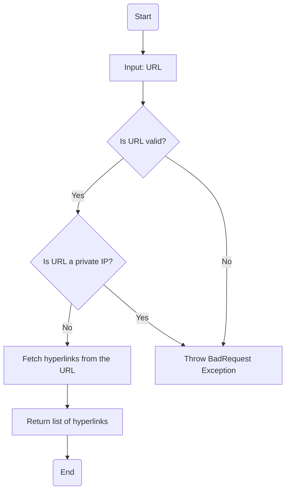
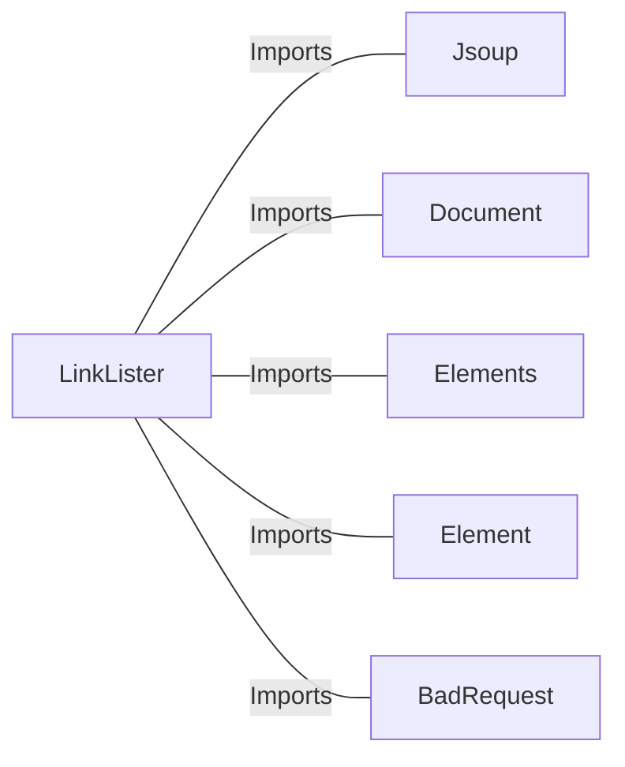

# LinkLister.java: Web Link Extractor with IP Validation

## Overview

The `LinkLister` class provides functionality to extract all hyperlinks (`<a>` tags) from a given URL. It includes two methods: 
1. `getLinks`: Extracts all hyperlinks from a given URL.
2. `getLinksV2`: Adds an additional layer of validation to prevent the use of private IP addresses in the URL.

## Process Flow

```mermaid
flowchart TD
    Start("Start")
    InputURL["Input: URL"]
    ValidateURL{"Is URL valid?"}
    PrivateIPCheck{"Is URL a private IP?"}
    FetchLinks["Fetch hyperlinks from the URL"]
    ReturnLinks["Return list of hyperlinks"]
    ThrowError["Throw BadRequest Exception"]
    End("End")

    Start --> InputURL --> ValidateURL
    ValidateURL --> |"Yes"| PrivateIPCheck
    ValidateURL --> |"No"| ThrowError
    PrivateIPCheck --> |"Yes"| ThrowError
    PrivateIPCheck --> |"No"| FetchLinks
    FetchLinks --> ReturnLinks --> End
```

## Insights

- **Core Functionality**: The class extracts hyperlinks from a webpage using the `Jsoup` library.
- **Private IP Validation**: The `getLinksV2` method ensures that the URL does not point to private IP ranges (e.g., `172.x.x.x`, `192.168.x.x`, `10.x.x.x`).
- **Error Handling**: The `getLinksV2` method throws a custom `BadRequest` exception for invalid URLs or private IPs.
- **Dependency on Jsoup**: The class relies on the `Jsoup` library for HTML parsing and hyperlink extraction.

## Dependencies

```mermaid
flowchart LR
    LinkLister --- |"Imports"| Jsoup
    LinkLister --- |"Imports"| Document
    LinkLister --- |"Imports"| Elements
    LinkLister --- |"Imports"| Element
    LinkLister --- |"Imports"| BadRequest
```

- `Jsoup`: Used for connecting to the URL and parsing the HTML document.
- `Document`: Represents the parsed HTML document.
- `Elements`: Represents a collection of HTML elements (e.g., `<a>` tags).
- `Element`: Represents a single HTML element.
- `BadRequest`: Custom exception class used for error handling.

## Vulnerabilities

1. **Unvalidated URL Input**:
   - The `getLinks` method directly connects to the provided URL without validating it. This could lead to potential security risks such as Server-Side Request Forgery (SSRF).

2. **Private IP Bypass**:
   - The `getLinksV2` method only checks for private IP ranges in the hostname. It does not account for URLs that resolve to private IPs via DNS, which could be exploited.

3. **Lack of HTTPS Enforcement**:
   - The methods do not enforce HTTPS, which could lead to insecure connections and potential man-in-the-middle attacks.

4. **Error Disclosure**:
   - The `getLinksV2` method exposes the exception message directly, which could reveal sensitive information about the system.

5. **Potential Infinite Redirects**:
   - The `Jsoup.connect(url).get()` call does not handle infinite redirects, which could lead to resource exhaustion.

## Recommendations

- **Input Validation**: Validate the URL format and ensure it adheres to expected patterns.
- **DNS Resolution Check**: Resolve the hostname to an IP address and verify it is not a private IP.
- **Enforce HTTPS**: Ensure that only HTTPS URLs are processed.
- **Error Handling**: Avoid exposing raw exception messages to the user.
- **Redirect Handling**: Limit the number of redirects allowed during the connection process.
