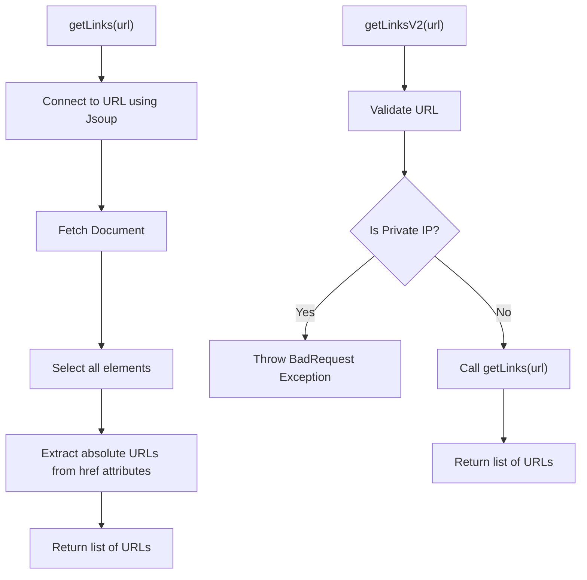
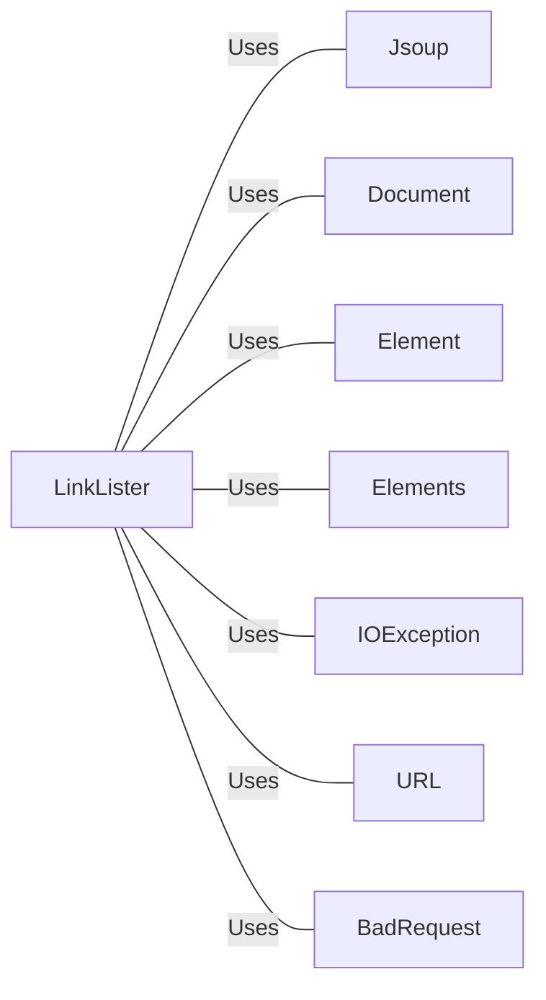

# LinkLister.java: Link Extraction Utility

## Overview
The `LinkLister` class provides methods to extract all hyperlinks from a given URL. It includes two methods: `getLinks` and `getLinksV2`. The `getLinks` method fetches and returns all hyperlinks from the specified URL, while `getLinksV2` adds an additional layer of validation to prevent the use of private IP addresses.

## Process Flow

```mermaid
flowchart TD
    A["getLinks(url)"] --> B["Connect to URL using Jsoup"]
    B --> C["Fetch Document"]
    C --> D["Select all <a> elements"]
    D --> E["Extract absolute URLs from href attributes"]
    E --> F["Return list of URLs"]

    G["getLinksV2(url)"] --> H["Validate URL"]
    H --> I{"Is Private IP?"}
    I -- Yes --> J["Throw BadRequest Exception"]
    I -- No --> K["Call getLinks(url)"]
    K --> L["Return list of URLs"]
```

## Insights
- The `getLinks` method uses Jsoup to connect to the provided URL and extract all hyperlinks.
- The `getLinksV2` method adds a validation step to ensure the URL does not point to a private IP address.
- The `getLinksV2` method throws a `BadRequest` exception if the URL points to a private IP address.

## Dependencies

```mermaid
flowchart LR
    LinkLister --- |"Uses"| Jsoup
    LinkLister --- |"Uses"| Document
    LinkLister --- |"Uses"| Element
    LinkLister --- |"Uses"| Elements
    LinkLister --- |"Uses"| IOException
    LinkLister --- |"Uses"| URL
    LinkLister --- |"Uses"| BadRequest
```

- `Jsoup`: Used to connect to the URL and parse the HTML document.
- `Document`: Represents the parsed HTML document.
- `Element`: Represents an HTML element.
- `Elements`: Represents a list of HTML elements.
- `IOException`: Handles input/output exceptions.
- `URL`: Used to validate the URL.
- `BadRequest`: Custom exception thrown when a private IP address is detected.

## Vulnerabilities
- **Potential SSRF (Server-Side Request Forgery)**: The `getLinks` method directly connects to the provided URL without any validation, which can be exploited to make the server connect to internal services.
- **Private IP Address Exposure**: The `getLinksV2` method attempts to mitigate SSRF by checking for private IP addresses, but it only checks for specific private IP ranges and may miss other potential private IP ranges or non-IP based internal addresses.
