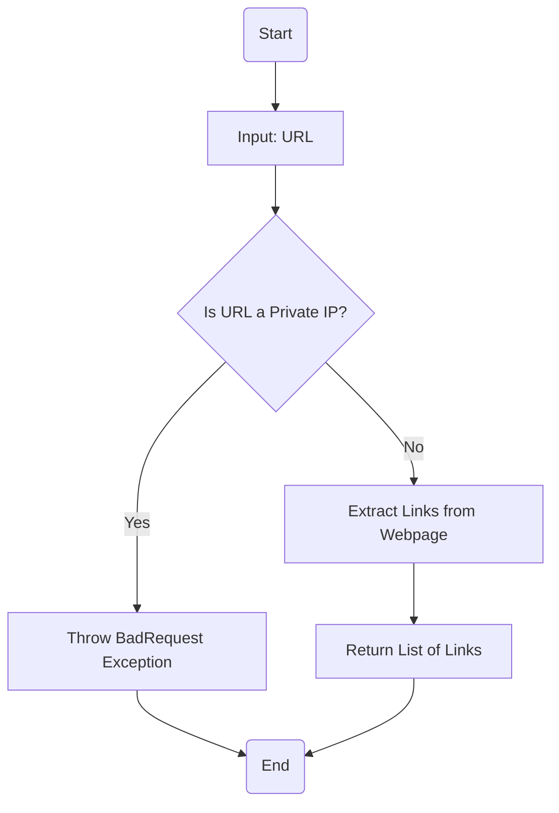
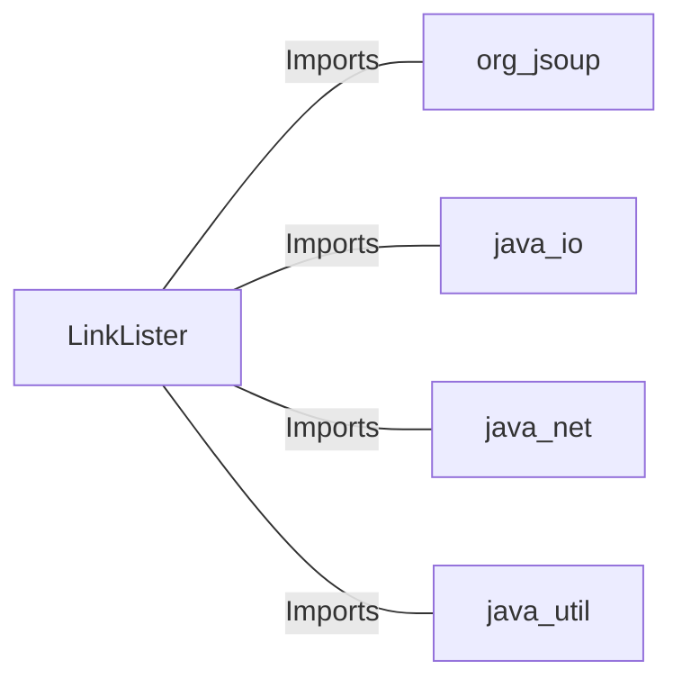

# LinkLister.java: Webpage Link Extractor

## Overview

The `LinkLister` class provides functionality to extract all hyperlinks (`<a>` tags) from a given webpage URL. It includes two methods: 
1. `getLinks`: Extracts all links from a webpage.
2. `getLinksV2`: Adds a security check to prevent accessing private IP addresses before extracting links.

## Process Flow

```mermaid
flowchart TD
    Start("Start")
    InputURL["Input: URL"]
    CheckPrivateIP{"Is URL a Private IP?"}
    ExtractLinks["Extract Links from Webpage"]
    ReturnLinks["Return List of Links"]
    ThrowError["Throw BadRequest Exception"]
    End("End")

    Start --> InputURL
    InputURL --> CheckPrivateIP
    CheckPrivateIP --> |"Yes"| ThrowError
    CheckPrivateIP --> |"No"| ExtractLinks
    ExtractLinks --> ReturnLinks
    ThrowError --> End
    ReturnLinks --> End
```

## Insights

- **Private IP Check**: The `getLinksV2` method ensures that private IP addresses (e.g., `172.x.x.x`, `192.168.x.x`, `10.x.x.x`) are not accessed, enhancing security.
- **HTML Parsing**: The `Jsoup` library is used to parse the HTML content of the webpage and extract `<a>` tags.
- **Error Handling**: The `getLinksV2` method wraps potential exceptions in a custom `BadRequest` exception for better error reporting.
- **Absolute URLs**: The `getLinks` method converts relative URLs to absolute URLs using `link.absUrl("href")`.

## Dependencies

```mermaid
flowchart LR
    LinkLister --- |"Imports"| org_jsoup
    LinkLister --- |"Imports"| java_io
    LinkLister --- |"Imports"| java_net
    LinkLister --- |"Imports"| java_util
```

- `org.jsoup`: Used for HTML parsing and link extraction.
- `java.io`: Handles potential IO exceptions during URL connection.
- `java.net`: Provides URL handling and validation.
- `java.util`: Used for managing the list of extracted links.

## Vulnerabilities

1. **Unvalidated Input**: 
   - The `getLinks` method directly connects to the provided URL without validating it. This could lead to SSRF (Server-Side Request Forgery) attacks if the input URL is malicious.
   - Mitigation: Validate the URL to ensure it points to a safe domain or IP range.

2. **Private IP Bypass**:
   - The `getLinksV2` method only checks for private IPs in the `host` field. However, attackers could use DNS rebinding to bypass this check.
   - Mitigation: Resolve the IP address of the hostname and verify it against private IP ranges.

3. **Lack of Timeout Configuration**:
   - The `Jsoup.connect(url).get()` call does not specify a timeout, which could lead to the application hanging indefinitely if the server does not respond.
   - Mitigation: Set a reasonable timeout using `Jsoup.connect(url).timeout(milliseconds)`.

4. **Potential Information Disclosure**:
   - The `System.out.println(host)` statement in `getLinksV2` could expose sensitive information about the host in logs.
   - Mitigation: Remove or replace with proper logging mechanisms.

5. **Unchecked Exceptions**:
   - The `getLinksV2` method catches all exceptions and wraps them in a `BadRequest` exception. This could mask critical issues like `NullPointerException` or `MalformedURLException`.
   - Mitigation: Handle specific exceptions explicitly and log unexpected errors.
