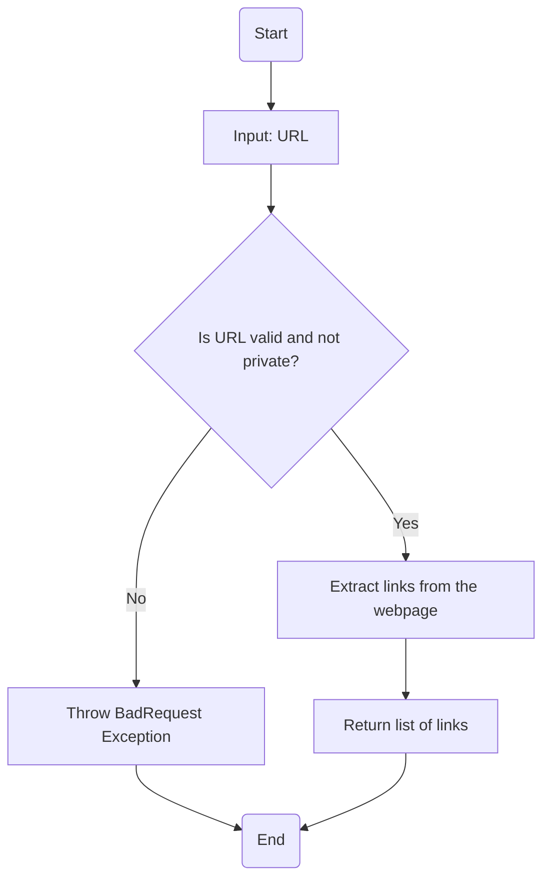
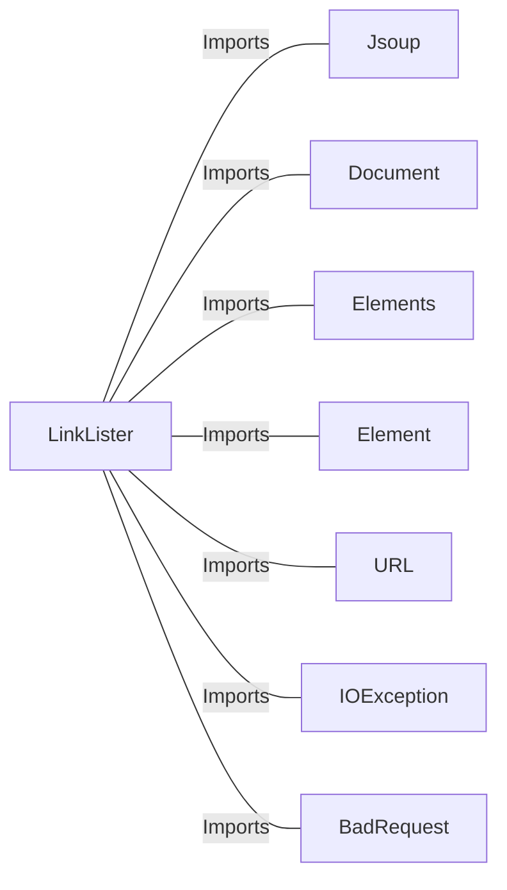

# LinkLister.java: Webpage Link Extractor

## Overview

The `LinkLister` class provides functionality to extract all hyperlinks (`<a>` tags) from a given webpage URL. It includes two methods: 
1. `getLinks`: Extracts all links from a webpage.
2. `getLinksV2`: Adds validation to prevent the use of private IP addresses in the URL before extracting links.

## Process Flow

```mermaid
flowchart TD
    Start("Start")
    InputURL["Input: URL"]
    ValidateURL{"Is URL valid and not private?"}
    ExtractLinks["Extract links from the webpage"]
    ReturnLinks["Return list of links"]
    ThrowError["Throw BadRequest Exception"]

    Start --> InputURL
    InputURL --> ValidateURL
    ValidateURL --> |"Yes"| ExtractLinks
    ValidateURL --> |"No"| ThrowError
    ExtractLinks --> ReturnLinks
    ThrowError --> End("End")
    ReturnLinks --> End
```

## Insights

- **Private IP Address Validation**: The `getLinksV2` method ensures that URLs pointing to private IP ranges (e.g., `172.*`, `192.168.*`, `10.*`) are rejected to prevent potential misuse or security risks.
- **Dependency on Jsoup**: The class uses the Jsoup library to parse HTML and extract links, simplifying the process of working with webpage content.
- **Custom Exception Handling**: The `getLinksV2` method throws a `BadRequest` exception for invalid or private IP URLs, providing a clear error-handling mechanism.
- **Potential Vulnerability**: The `getLinks` method does not validate the input URL, which could lead to security risks such as Server-Side Request Forgery (SSRF).

## Dependencies

```mermaid
flowchart LR
    LinkLister --- |"Imports"| Jsoup
    LinkLister --- |"Imports"| Document
    LinkLister --- |"Imports"| Elements
    LinkLister --- |"Imports"| Element
    LinkLister --- |"Imports"| URL
    LinkLister --- |"Imports"| IOException
    LinkLister --- |"Imports"| BadRequest
```

- `Jsoup`: Used for connecting to the webpage and parsing its HTML content.
- `Document`: Represents the parsed HTML document.
- `Elements`: Represents a collection of HTML elements (e.g., `<a>` tags).
- `Element`: Represents a single HTML element.
- `URL`: Used for URL validation and parsing.
- `IOException`: Handles input/output exceptions during URL connection.
- `BadRequest`: Custom exception for invalid or private IP URLs.

## Vulnerabilities

1. **Server-Side Request Forgery (SSRF)**:
   - The `getLinks` method directly connects to the provided URL without any validation. This could allow an attacker to exploit the method to make requests to internal or sensitive endpoints.
   - Mitigation: Add URL validation to `getLinks` similar to `getLinksV2`.

2. **Lack of HTTPS Enforcement**:
   - The methods do not enforce HTTPS, which could lead to insecure connections.
   - Mitigation: Validate the URL to ensure it uses the HTTPS protocol.

3. **Unrestricted External Requests**:
   - The `getLinks` method allows unrestricted requests to any external URL, which could be abused for malicious purposes.
   - Mitigation: Implement a whitelist of allowed domains or restrict the method to specific trusted domains.

4. **Potential Information Disclosure**:
   - The `getLinksV2` method prints the host of the URL to the console, which could inadvertently expose sensitive information in logs.
   - Mitigation: Remove or secure logging to avoid exposing sensitive data.
