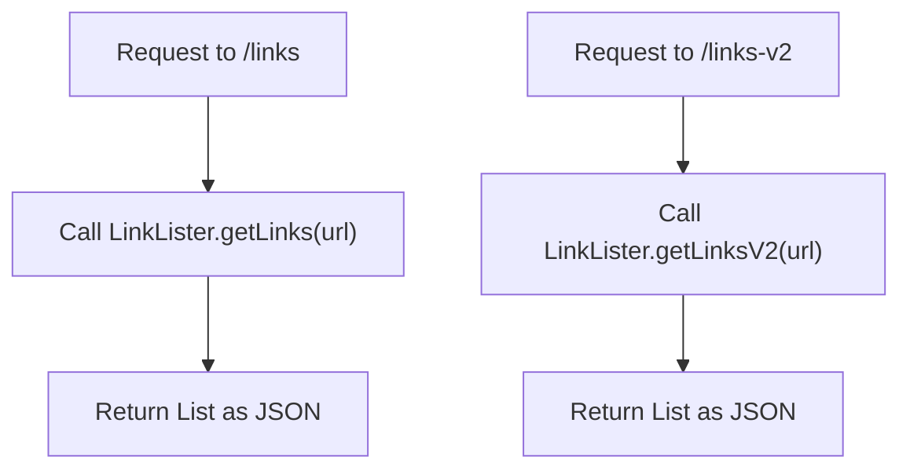
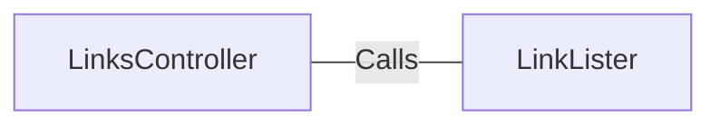

# LinksController.java: REST Controller for Link Listing

## Overview
The `LinksController` class is a REST controller that provides endpoints to list links from a given URL. It uses the `LinkLister` class to fetch the links and returns them in JSON format.

## Process Flow

## Insights
- The class is annotated with `@RestController` and `@EnableAutoConfiguration`, making it a Spring Boot REST controller with auto-configuration enabled.
- There are two endpoints provided:
  - `/links`: Fetches links using `LinkLister.getLinks(url)`.
  - `/links-v2`: Fetches links using `LinkLister.getLinksV2(url)`.
- The `/links` endpoint can throw an `IOException`.
- The `/links-v2` endpoint can throw a `BadRequest` exception.

## Dependencies

- `LinkLister`: Used to fetch links from the provided URL.

## Vulnerabilities
- The `@RequestParam String url` parameter is directly passed to the `LinkLister` methods without any validation or sanitization, which could lead to security vulnerabilities such as URL injection or SSRF (Server-Side Request Forgery). Proper validation and sanitization of the input URL should be implemented to mitigate these risks.
