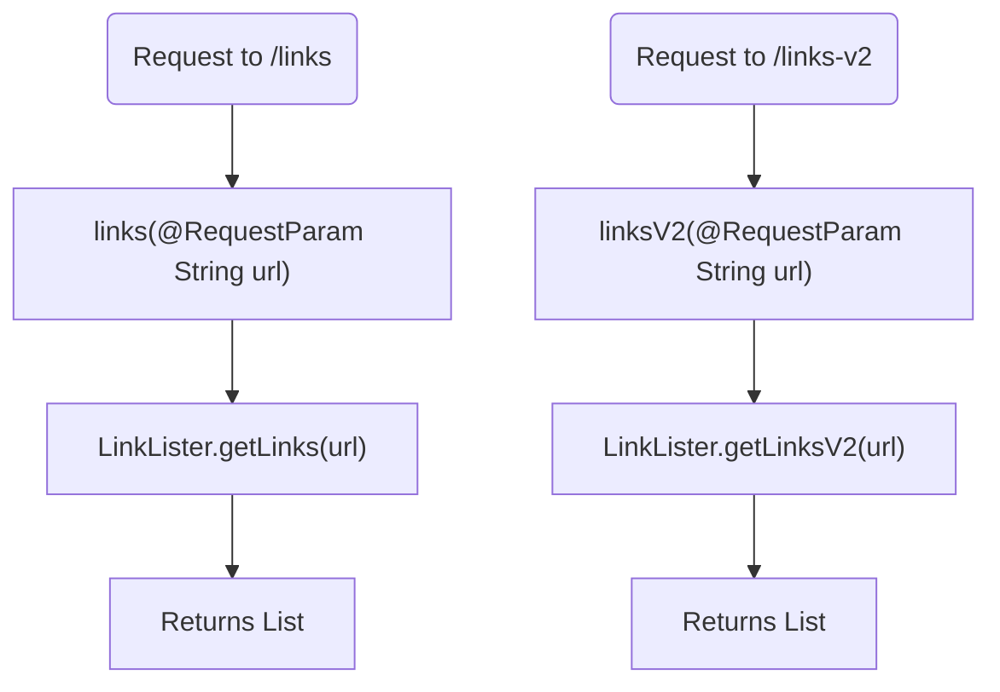

# LinksController.java: Links Management Controller

## Overview
The `LinksController` class is a Spring Boot REST controller responsible for handling HTTP requests related to link listing operations. It provides endpoints to retrieve links from a given URL.

## Process Flow

## Insights
- The class is annotated with `@RestController` and `@EnableAutoConfiguration`, making it a Spring Boot REST controller with auto-configuration enabled.
- The `links` method handles requests to the `/links` endpoint and returns a list of links from the provided URL using the `LinkLister.getLinks` method.
- The `linksV2` method handles requests to the `/links-v2` endpoint and returns a list of links from the provided URL using the `LinkLister.getLinksV2` method.
- The `links` method can throw an `IOException`, while the `linksV2` method can throw a `BadRequest` exception.

## Dependencies

- `LinkLister`: The class responsible for fetching links from the provided URL.

## Vulnerabilities
- **Potential Security Risk**: The `url` parameter is directly passed to the `LinkLister.getLinks` and `LinkLister.getLinksV2` methods without validation or sanitization. This could lead to security vulnerabilities such as URL injection or SSRF (Server-Side Request Forgery).
- **Exception Handling**: The `links` method throws a generic `IOException`, which may not provide sufficient information about the nature of the error. Consider using more specific exception handling and providing meaningful error responses to the client.
