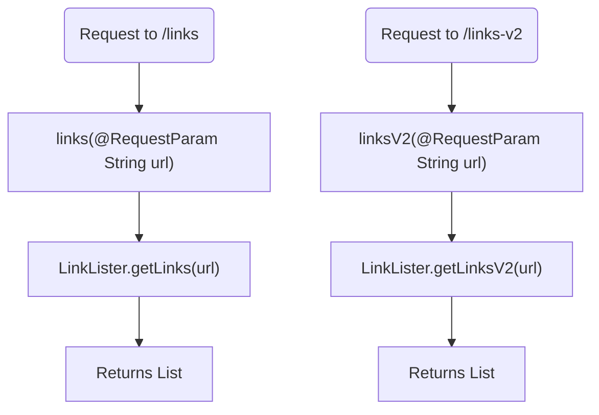
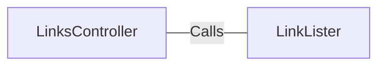

# LinksController.java: Links Management Controller

## Overview
The `LinksController` class is a Spring Boot REST controller responsible for handling HTTP requests related to link management. It provides endpoints to retrieve links from a given URL.

## Process Flow

## Insights
- The class is annotated with `@RestController` and `@EnableAutoConfiguration`, making it a Spring Boot REST controller with auto-configuration enabled.
- It defines two endpoints:
  - `/links`: Calls `LinkLister.getLinks(url)` to retrieve links from the provided URL.
  - `/links-v2`: Calls `LinkLister.getLinksV2(url)` to retrieve links from the provided URL, but throws a `BadRequest` exception if there is an issue.
- Both endpoints produce JSON responses.

## Dependencies

- `LinkLister`: Provides methods `getLinks(url)` and `getLinksV2(url)` to retrieve links from a given URL.

## vulnerabilities
- The `links` method may be vulnerable to URL injection attacks if the `LinkLister.getLinks(url)` method does not properly validate or sanitize the input URL.
- The `linksV2` method may also be vulnerable to URL injection attacks if the `LinkLister.getLinksV2(url)` method does not properly validate or sanitize the input URL.
