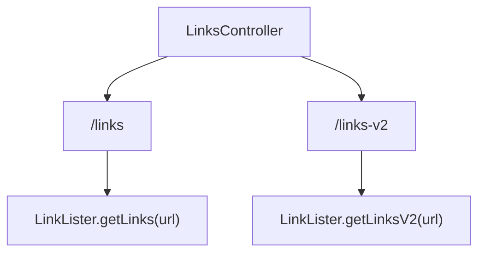
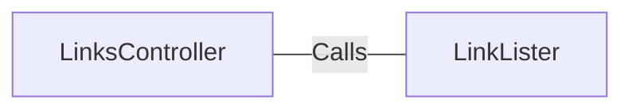

# LinksController.java: REST Controller for Link Listing

## Overview
The `LinksController` class is a REST controller that provides endpoints to list links from a given URL. It has two endpoints: `/links` and `/links-v2`, which return lists of links in JSON format.

## Process Flow

## Insights
- The class is annotated with `@RestController` and `@EnableAutoConfiguration`, indicating it is a Spring Boot REST controller with auto-configuration enabled.
- The `/links` endpoint calls `LinkLister.getLinks(url)` and returns a list of links in JSON format.
- The `/links-v2` endpoint calls `LinkLister.getLinksV2(url)` and returns a list of links in JSON format.
- The `links` method can throw an `IOException`.
- The `linksV2` method can throw a `BadRequest` exception.

## Dependencies

- `LinkLister`: Provides methods `getLinks(url)` and `getLinksV2(url)` to fetch links from the given URL.

## Vulnerabilities
- The `links` method directly accepts a URL as a request parameter and passes it to `LinkLister.getLinks(url)`. This could potentially lead to security issues such as URL injection or SSRF (Server-Side Request Forgery) if the input is not properly validated or sanitized.
- Similarly, the `linksV2` method also accepts a URL as a request parameter and passes it to `LinkLister.getLinksV2(url)`, which could have similar security implications if not properly handled.
