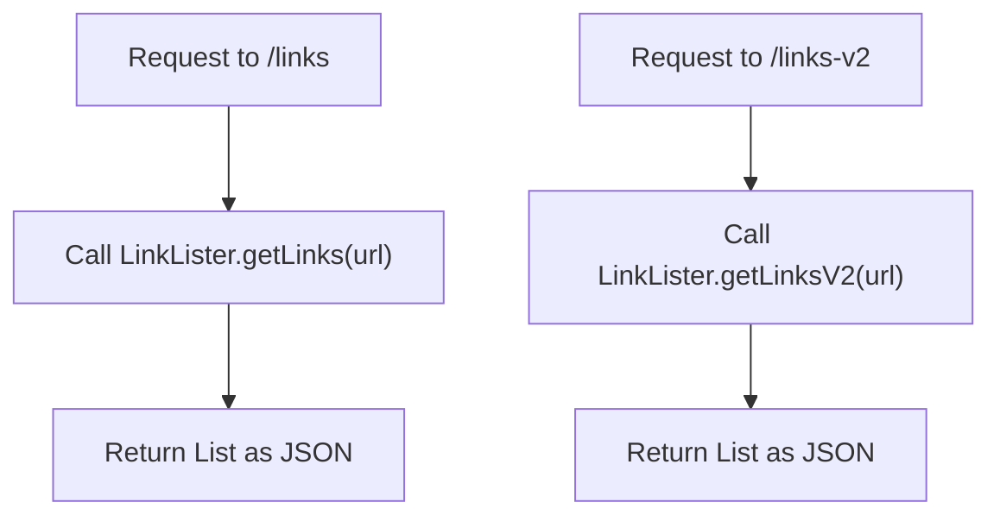
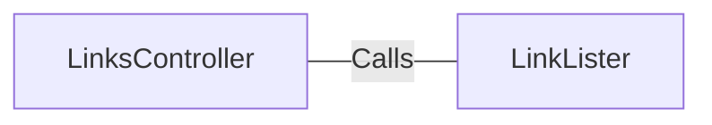

# LinksController.java: Links Management Controller

## Overview
The `LinksController` class is a Spring Boot REST controller that provides endpoints to fetch links from a given URL. It has two endpoints, `/links` and `/links-v2`, which return a list of links in JSON format.

## Process Flow

```mermaid
flowchart TD
    A["Request to /links"] --> B["Call LinkLister.getLinks(url)"]
    B --> C["Return List<String> as JSON"]
    
    D["Request to /links-v2"] --> E["Call LinkLister.getLinksV2(url)"]
    E --> F["Return List<String> as JSON"]
```

## Insights
- The class is annotated with `@RestController` and `@EnableAutoConfiguration`, making it a Spring Boot REST controller with automatic configuration.
- The `/links` endpoint calls `LinkLister.getLinks(url)` and returns the result as a JSON list.
- The `/links-v2` endpoint calls `LinkLister.getLinksV2(url)` and returns the result as a JSON list.
- The `links` method can throw an `IOException`.
- The `linksV2` method can throw a `BadRequest` exception.

## Dependencies

```mermaid
flowchart LR
    LinksController --- |"Calls"| LinkLister
```

- `LinkLister`: Provides methods `getLinks(url)` and `getLinksV2(url)` to fetch links from a given URL.

## Vulnerabilities
- The `@RequestParam String url` parameter is directly passed to the `LinkLister` methods without any validation or sanitization, which could lead to security vulnerabilities such as URL injection or SSRF (Server-Side Request Forgery). It is recommended to validate and sanitize the input URL before processing.
