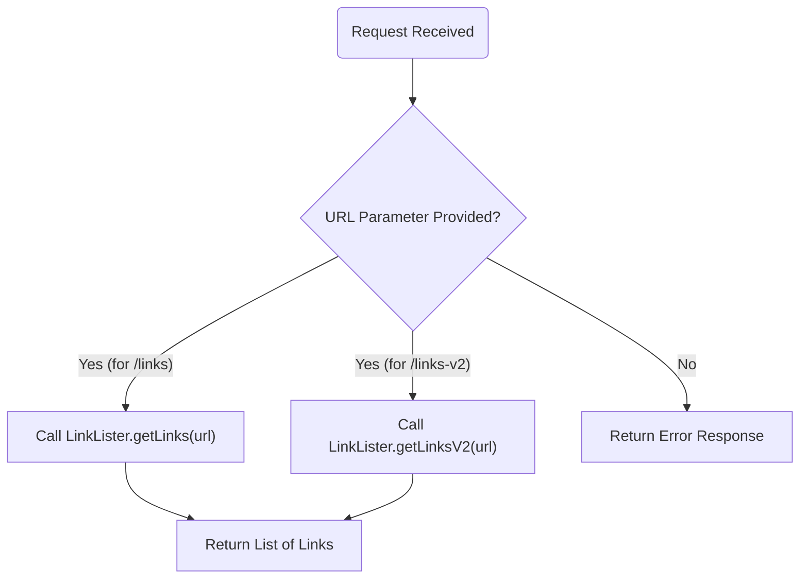
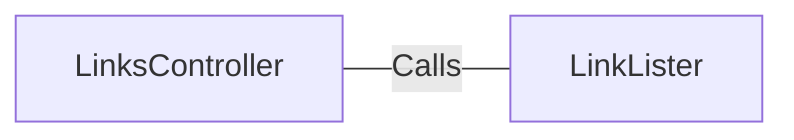

# LinksController.java: REST Controller for Link Extraction

## Overview
The `LinksController` class is a REST controller in a Spring Boot application. It provides two endpoints (`/links` and `/links-v2`) to extract and return a list of links from a given URL. The class uses the `LinkLister` utility to perform the actual link extraction.

## Process Flow

```mermaid
flowchart TD
    Start("Request Received")
    CheckURL{"URL Parameter Provided?"}
    ExtractLinks1["Call LinkLister.getLinks(url)"]
    ExtractLinks2["Call LinkLister.getLinksV2(url)"]
    ReturnLinks["Return List of Links"]
    Error["Return Error Response"]

    Start --> CheckURL
    CheckURL --> |"Yes (for /links)"| ExtractLinks1
    CheckURL --> |"Yes (for /links-v2)"| ExtractLinks2
    CheckURL --> |"No"| Error
    ExtractLinks1 --> ReturnLinks
    ExtractLinks2 --> ReturnLinks
```

## Insights
- The class defines two endpoints:
  - `/links`: Uses `LinkLister.getLinks(url)` to extract links.
  - `/links-v2`: Uses `LinkLister.getLinksV2(url)` to extract links.
- Both endpoints expect a `url` query parameter.
- The `/links-v2` endpoint throws a custom `BadRequest` exception, while `/links` throws an `IOException`.
- The `LinkLister` class is a dependency that performs the actual link extraction logic.

## Dependencies

```mermaid
flowchart LR
    LinksController --- |"Calls"| LinkLister
```

- `LinkLister`: Provides the `getLinks(url)` and `getLinksV2(url)` methods to extract links from the given URL.

## Vulnerabilities
1. **Potential Security Risks with URL Input**:
   - The `url` parameter is directly passed to the `LinkLister` methods without validation or sanitization. This could lead to security vulnerabilities such as Server-Side Request Forgery (SSRF) or other injection attacks.

2. **Error Handling**:
   - The `/links` endpoint throws a generic `IOException`, which may expose internal details of the application if not properly handled.
   - The `/links-v2` endpoint throws a `BadRequest` exception, but the implementation of this exception is not shown, so its behavior is unclear.

3. **Lack of Input Validation**:
   - There is no validation to ensure that the `url` parameter is a valid and safe URL.

4. **No Authentication or Authorization**:
   - The endpoints are publicly accessible without any authentication or authorization checks, which could expose the application to unauthorized use.

5. **Dependency on `LinkLister`**:
   - The security and reliability of the endpoints depend heavily on the implementation of the `LinkLister` class, which is not provided. If `LinkLister` has vulnerabilities, they could propagate to this controller.

## Recommendations
- Validate and sanitize the `url` parameter to prevent SSRF and other injection attacks.
- Implement proper error handling to avoid exposing internal application details.
- Add authentication and authorization mechanisms to restrict access to the endpoints.
- Review the `LinkLister` implementation to ensure it is secure and reliable.
