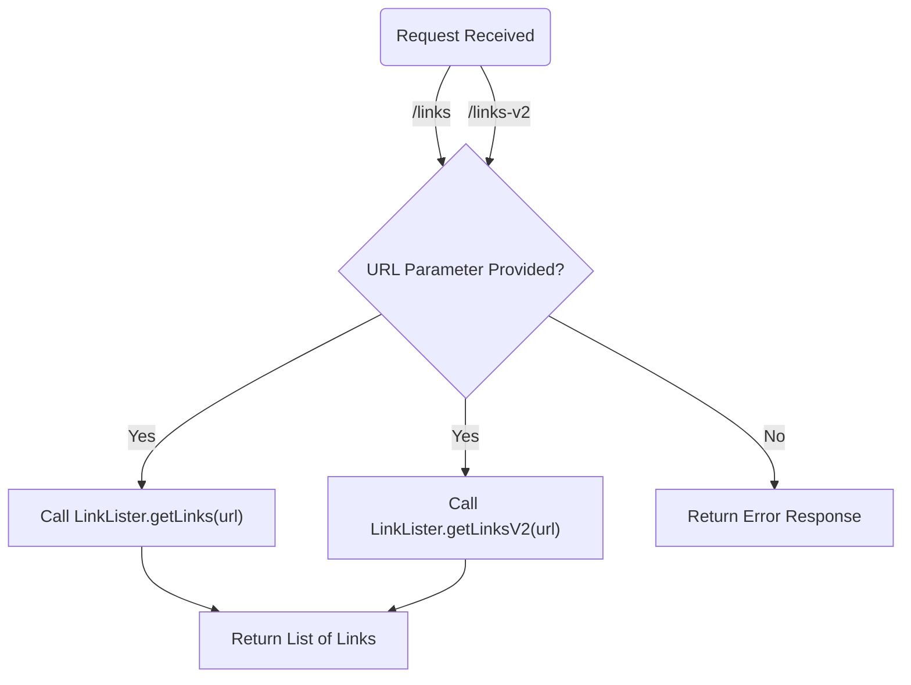
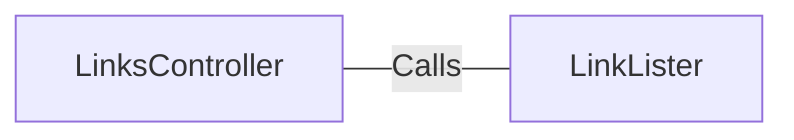

# LinksController.java: REST Controller for Link Extraction

## Overview
This Java class defines a REST controller for handling HTTP requests related to extracting links from a given URL. It provides two endpoints (`/links` and `/links-v2`) that process a URL parameter and return a list of links extracted from the provided URL.

## Process Flow

```mermaid
flowchart TD
    Start("Request Received")
    CheckURL{"URL Parameter Provided?"}
    CallLinkLister["Call LinkLister.getLinks(url)"]
    CallLinkListerV2["Call LinkLister.getLinksV2(url)"]
    ReturnLinks["Return List of Links"]
    ErrorResponse["Return Error Response"]

    Start --> |"/links"| CheckURL
    Start --> |"/links-v2"| CheckURL
    CheckURL --> |"Yes"| CallLinkLister
    CheckURL --> |"Yes"| CallLinkListerV2
    CheckURL --> |"No"| ErrorResponse
    CallLinkLister --> ReturnLinks
    CallLinkListerV2 --> ReturnLinks
```

## Insights
- The class is annotated with `@RestController` and `@EnableAutoConfiguration`, making it a Spring Boot REST controller with automatic configuration.
- Two endpoints are defined:
  - `/links`: Calls `LinkLister.getLinks(url)` to extract links.
  - `/links-v2`: Calls `LinkLister.getLinksV2(url)` to extract links, but throws a custom `BadRequest` exception in case of errors.
- Both endpoints expect a `url` parameter and return a list of links in JSON format.
- The `IOException` and `BadRequest` exceptions are handled implicitly, but no explicit error-handling mechanism is implemented in the code.

## Dependencies

```mermaid
flowchart LR
    LinksController --- |"Calls"| LinkLister
```

- `LinkLister`: Provides the methods `getLinks(url)` and `getLinksV2(url)` to extract links from the given URL.

### Identified External References
- `LinkLister`: 
  - `getLinks(url)`: Processes the provided URL and returns a list of links.
  - `getLinksV2(url)`: Processes the provided URL and returns a list of links, with additional error handling.

## Vulnerabilities
1. **Lack of Input Validation**:
   - The `url` parameter is directly passed to the `LinkLister` methods without validation. This could lead to security vulnerabilities such as SSRF (Server-Side Request Forgery) or injection attacks.

2. **Error Handling**:
   - The `/links` endpoint does not handle exceptions explicitly, which may result in exposing stack traces or sensitive information to the client.
   - The `/links-v2` endpoint throws a `BadRequest` exception, but there is no global exception handler to standardize error responses.

3. **Potential SSRF Risk**:
   - If `LinkLister.getLinks` or `LinkLister.getLinksV2` fetches content from the provided URL, it could be exploited for SSRF attacks if the URL is not properly validated or sanitized.

4. **No Rate Limiting or Authentication**:
   - The endpoints are publicly accessible without any authentication or rate limiting, making them susceptible to abuse.

5. **No HTTPS Enforcement**:
   - The code does not enforce HTTPS, which could lead to data interception in transit.

## Recommendations
- Implement input validation and sanitization for the `url` parameter to prevent SSRF and other injection attacks.
- Add a global exception handler to standardize error responses and avoid exposing sensitive information.
- Introduce authentication and rate limiting to secure the endpoints.
- Enforce HTTPS to ensure secure communication.
- Consider logging and monitoring to detect and mitigate potential abuse.
