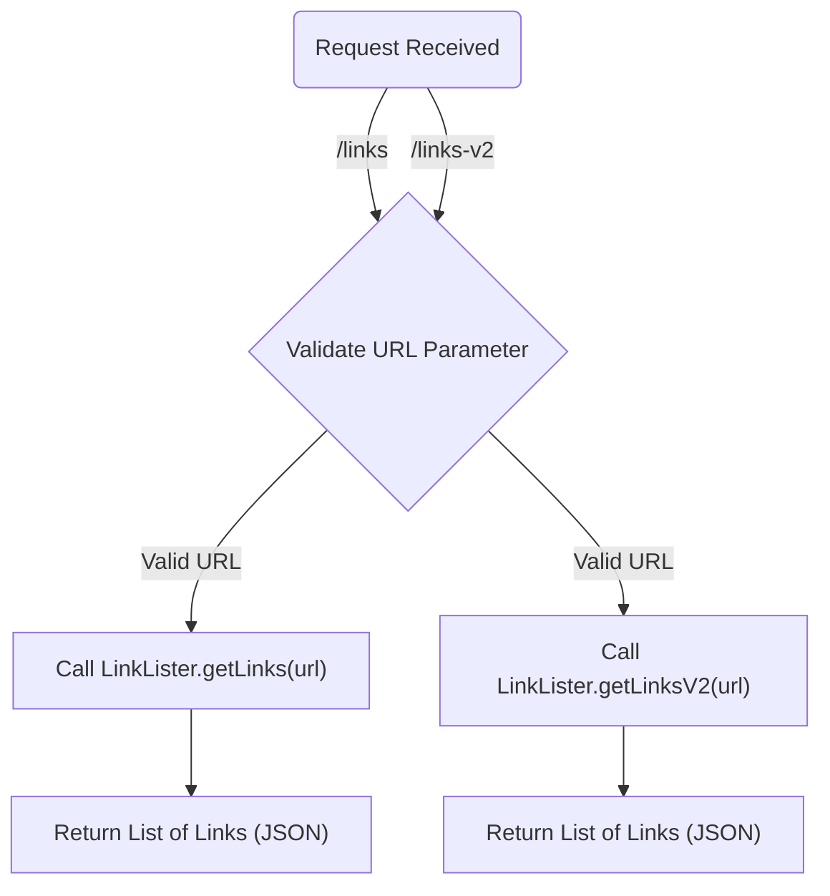
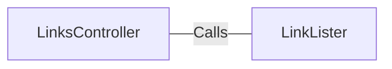

# LinksController.java: REST Controller for Link Extraction

## Overview
This Java class defines a REST controller for handling HTTP requests related to extracting links from a given URL. It provides two endpoints (`/links` and `/links-v2`) that process a URL parameter and return a list of links extracted from the provided URL.

## Process Flow

```mermaid
flowchart TD
    Start("Request Received")
    CheckURL{"Validate URL Parameter"}
    CallLinkLister1["Call LinkLister.getLinks(url)"]
    CallLinkLister2["Call LinkLister.getLinksV2(url)"]
    ReturnLinks1["Return List of Links (JSON)"]
    ReturnLinks2["Return List of Links (JSON)"]
    
    Start --> |"/links"| CheckURL
    CheckURL --> |"Valid URL"| CallLinkLister1
    CallLinkLister1 --> ReturnLinks1
    
    Start --> |"/links-v2"| CheckURL
    CheckURL --> |"Valid URL"| CallLinkLister2
    CallLinkLister2 --> ReturnLinks2
```

## Insights
- The class is annotated with `@RestController` and `@EnableAutoConfiguration`, making it a Spring Boot REST controller with automatic configuration.
- Two endpoints are defined:
  - `/links`: Calls `LinkLister.getLinks(url)` to extract links.
  - `/links-v2`: Calls `LinkLister.getLinksV2(url)` to extract links, with a different implementation or validation logic.
- Both endpoints expect a `url` parameter and return a JSON list of links.
- The `/links-v2` endpoint throws a custom `BadRequest` exception, indicating stricter validation or error handling compared to `/links`.

## Dependencies

```mermaid
flowchart LR
    LinksController --- |"Calls"| LinkLister
```

- `LinkLister`: Provides the `getLinks` and `getLinksV2` methods for extracting links from a URL.

### Identified External References
- `LinkLister`: 
  - `getLinks(url)`: Processes the provided URL and returns a list of links.
  - `getLinksV2(url)`: Processes the provided URL with stricter validation or logic and returns a list of links.

## Vulnerabilities
- **Potential Security Risks with URL Input**:
  - The `url` parameter is directly passed to the `LinkLister` methods without any apparent validation or sanitization. This could lead to:
    - **Server-Side Request Forgery (SSRF)**: If the `LinkLister` methods make HTTP requests to the provided URL, an attacker could exploit this to access internal services or sensitive data.
    - **Denial of Service (DoS)**: Malicious URLs could cause the application to hang or crash.
  - Mitigation: Validate and sanitize the `url` parameter to ensure it is safe and conforms to expected formats.

- **Error Handling**:
  - The `/links` endpoint does not handle exceptions explicitly, which could expose stack traces or sensitive information in the response.
  - Mitigation: Implement proper exception handling and return user-friendly error messages.

- **Custom Exception (`BadRequest`)**:
  - The `/links-v2` endpoint uses a custom `BadRequest` exception, but its implementation is not shown. Ensure that this exception is properly defined and handled to avoid unexpected behavior.

- **Dependency on `LinkLister`**:
  - The security and reliability of the endpoints depend heavily on the implementation of the `LinkLister` methods. Ensure that these methods are secure and robust.
