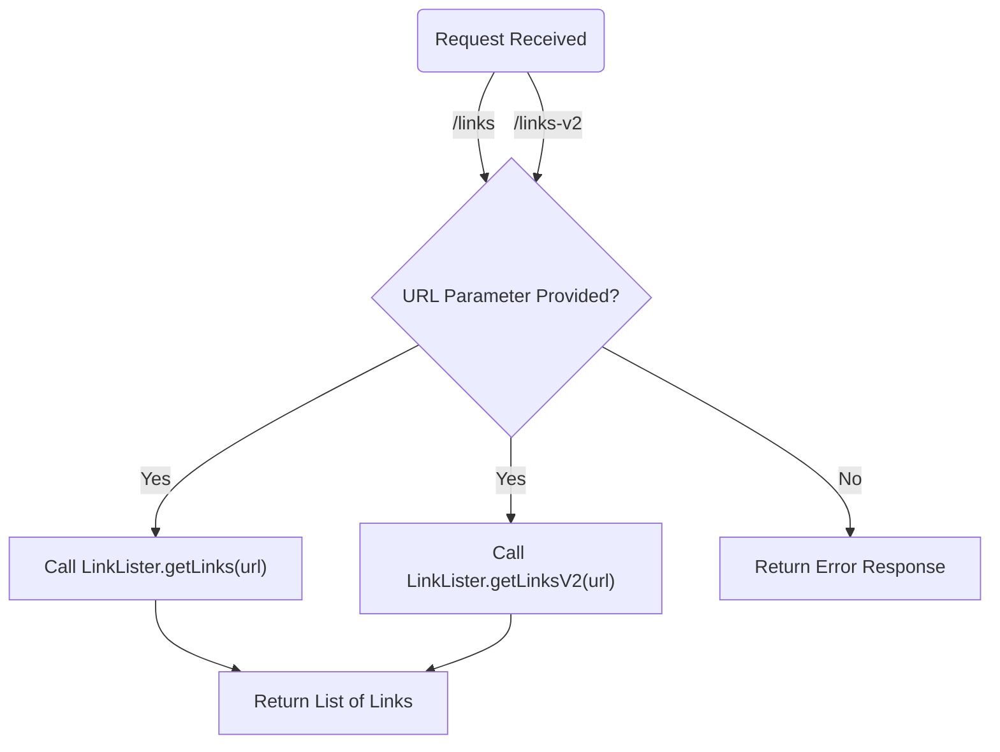
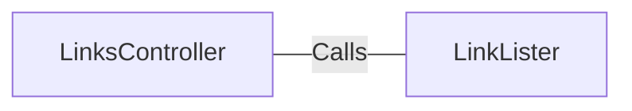

# LinksController.java: REST Controller for Link Extraction

## Overview
The `LinksController` class is a REST controller in a Spring Boot application. It provides two endpoints (`/links` and `/links-v2`) to extract and return a list of links from a given URL. The class uses the `LinkLister` utility to perform the actual link extraction.

## Process Flow

```mermaid
flowchart TD
    Start("Request Received")
    CheckURL{"URL Parameter Provided?"}
    ExtractLinks1["Call LinkLister.getLinks(url)"]
    ExtractLinks2["Call LinkLister.getLinksV2(url)"]
    ReturnLinks["Return List of Links"]
    Error["Return Error Response"]

    Start --> |"/links"| CheckURL
    Start --> |"/links-v2"| CheckURL
    CheckURL --> |"Yes"| ExtractLinks1
    CheckURL --> |"Yes"| ExtractLinks2
    CheckURL --> |"No"| Error
    ExtractLinks1 --> ReturnLinks
    ExtractLinks2 --> ReturnLinks
```

## Insights
- The class is annotated with `@RestController` and `@EnableAutoConfiguration`, making it a Spring Boot REST controller with automatic configuration.
- Two endpoints are defined:
  - `/links`: Calls `LinkLister.getLinks(url)` to extract links.
  - `/links-v2`: Calls `LinkLister.getLinksV2(url)` to extract links.
- Both endpoints expect a `url` query parameter and return a list of links in JSON format.
- The `/links-v2` endpoint throws a custom `BadRequest` exception, indicating additional error handling or validation in `LinkLister.getLinksV2`.

## Dependencies

```mermaid
flowchart LR
    LinksController --- |"Calls"| LinkLister
```

- `LinkLister`: Provides the `getLinks` and `getLinksV2` methods for extracting links from a given URL.

## Vulnerabilities
- **Potential Security Risk**: The `url` parameter is directly passed to the `LinkLister` methods without validation or sanitization. This could lead to:
  - **Server-Side Request Forgery (SSRF)**: If the `LinkLister` methods make HTTP requests to the provided URL, an attacker could exploit this to access internal services or sensitive data.
  - **Denial of Service (DoS)**: Malicious URLs could cause the application to hang or crash.
- **Error Handling**: The `/links` endpoint does not handle exceptions explicitly, which could result in unhandled exceptions being exposed to the client.
- **Input Validation**: There is no validation to ensure the `url` parameter is a valid and safe URL.

## Recommendations
- Validate and sanitize the `url` parameter to prevent SSRF and other injection attacks.
- Implement proper exception handling for the `/links` endpoint to avoid exposing stack traces or sensitive information.
- Consider rate-limiting or other mechanisms to prevent abuse of the endpoints.
