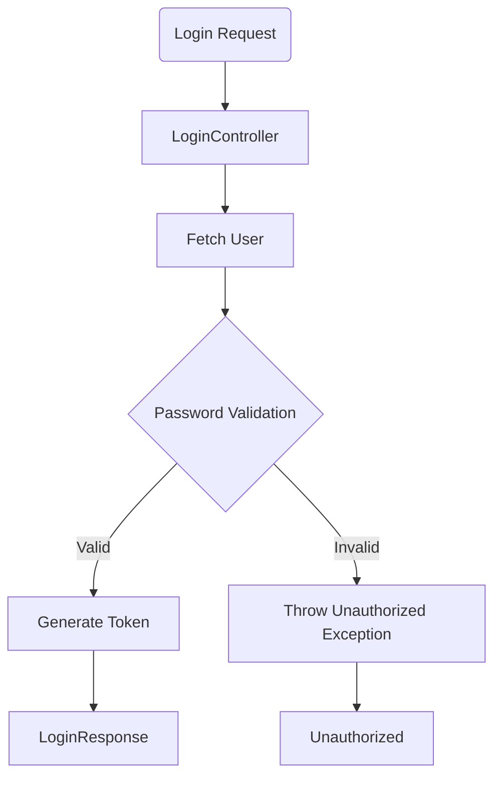
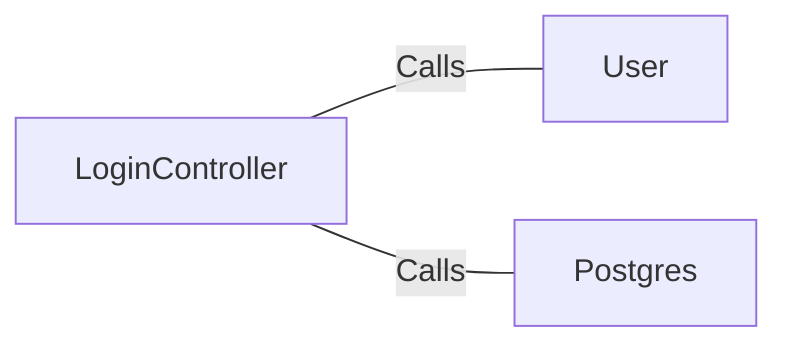

# LoginController.java: Login Controller

## Overview
The `LoginController` class handles user login requests. It validates the user's credentials and returns a token if the authentication is successful. If the authentication fails, it throws an `Unauthorized` exception.

## Process Flow

## Insights
- The `LoginController` class uses Spring Boot annotations to define a REST controller and enable auto-configuration.
- The `login` method handles POST requests to the `/login` endpoint, consuming and producing JSON.
- The `login` method fetches the user details and validates the password using MD5 hashing.
- If the password is valid, a token is generated using a secret value and returned in the `LoginResponse`.
- If the password is invalid, an `Unauthorized` exception is thrown with a status of `HttpStatus.UNAUTHORIZED`.

## Dependencies

- `User`: Fetches user details based on the username.
- `Postgres`: Validates the password using MD5 hashing.

## Vulnerabilities
- **Hardcoded Secret**: The secret value used for token generation is fetched from application properties, which might be hardcoded and not securely managed.
- **MD5 Hashing**: MD5 is not a secure hashing algorithm for passwords. It is vulnerable to collision attacks and should be replaced with a stronger hashing algorithm like bcrypt or Argon2.
- **Cross-Origin Resource Sharing (CORS)**: The `@CrossOrigin` annotation allows requests from any origin, which might expose the application to security risks. It is recommended to restrict the origins to trusted domains.
- **Exception Handling**: Throwing a generic `Unauthorized` exception without detailed logging might make it difficult to trace authentication issues.
