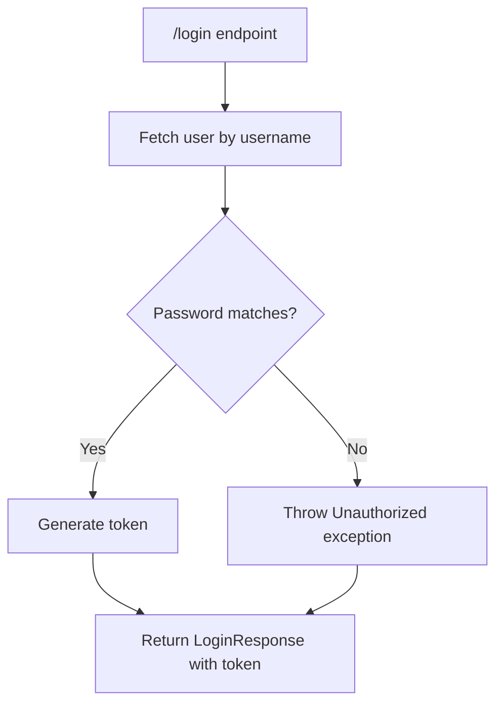
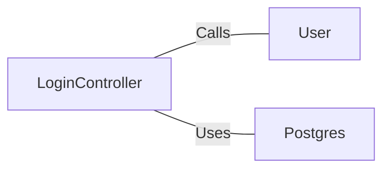

# LoginController.java: Login Controller for User Authentication

## Overview
The `LoginController` class handles user login requests. It validates user credentials and returns a token if the credentials are correct. If the credentials are invalid, it throws an `Unauthorized` exception.

## Process Flow

## Insights
- The `LoginController` class is annotated with `@RestController` and `@EnableAutoConfiguration`, indicating it is a Spring Boot controller with automatic configuration.
- The `login` method handles POST requests to the `/login` endpoint, consuming and producing JSON.
- The `@CrossOrigin` annotation allows cross-origin requests from any origin.
- The `login` method fetches the user by username and compares the hashed password with the stored hashed password.
- If the passwords match, a token is generated and returned in a `LoginResponse`.
- If the passwords do not match, an `Unauthorized` exception is thrown.

## Dependencies

- `User`: Fetches user details by username.
- `Postgres`: Provides the `md5` method to hash the password.

## Data Manipulation (SQL)
- `User`: Fetches user details from the database based on the provided username.

## Vulnerabilities
- **Hardcoded Secret**: The secret used for token generation is fetched from application properties, which might be hardcoded and not securely managed.
- **Cross-Origin Resource Sharing (CORS)**: Allowing all origins (`origins = "*"`) can expose the application to Cross-Site Request Forgery (CSRF) attacks.
- **Password Hashing**: Using MD5 for password hashing is insecure as MD5 is considered cryptographically broken and unsuitable for further use. Consider using a stronger hashing algorithm like bcrypt or Argon2.
- **Error Handling**: The `Unauthorized` exception reveals that access is denied, which might help attackers to infer valid usernames. Consider using a generic error message.
