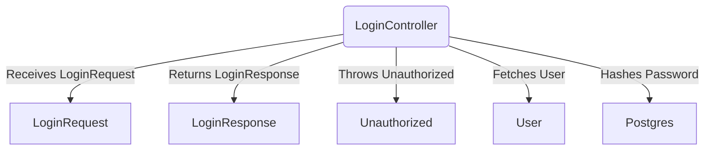
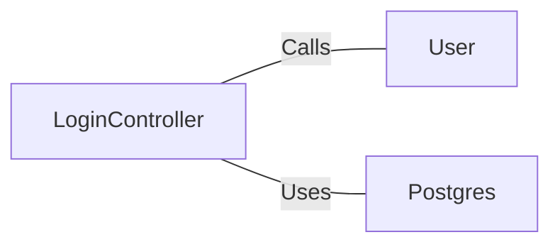

# LoginController.java: Login Controller

## Overview
The `LoginController` class handles user login requests. It validates user credentials and returns a token if the credentials are correct. If the credentials are invalid, it throws an `Unauthorized` exception.

## Process Flow

## Insights
- The `LoginController` class is annotated with `@RestController` and `@EnableAutoConfiguration`, making it a Spring Boot REST controller.
- The `login` method handles POST requests to the `/login` endpoint, consuming and producing JSON.
- The `login` method uses `@CrossOrigin(origins = "*")` to allow cross-origin requests from any domain.
- The `login` method fetches the user details from the `User` class and validates the password using the `Postgres.md5` method.
- If the password is correct, it returns a `LoginResponse` containing a token generated using the secret.
- If the password is incorrect, it throws an `Unauthorized` exception with the message "Access Denied".

## Dependencies

- `User`: Fetches user details based on the username.
- `Postgres`: Hashes the password using the MD5 algorithm.

## Data Manipulation (SQL)
- `User`: Fetches user details from the database based on the username.
